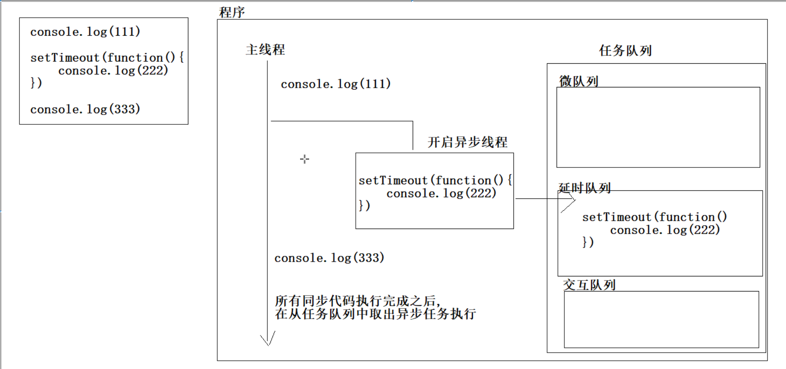

## Promise

### Promise 的构造函数

Promise 构造函数是 JavaScript 中用于创建 Promise 对象的内置构造函数。

Promise 构造函数接受一个函数作为参数，该函数是**同步**的并且会被**立即执行**，所以我们称之为起始函数。起始函数包含两个参数 `resolve` 和 `reject`，分别表示 Promise *兑现* 和 *拒绝* 的状态。

起始函数执行成功时，它应该 *调用*  `resolve` 函数并传递成功的结果（兑现值）。当起始函数执行失败时，它应该 *调用*  `reject` 函数并传递失败的原因（拒绝值）。

Promise 构造函数返回一个 Promise 对象，该对象具有几个方法。

- then：用于处理 Promise 成功状态的回调函数。
- catch：用于处理 Promise 失败状态的回调函数。
- finally：无论 Promise 是成功还是失败，都会执行的回调函数。

> 前面我们学习时，知道当then的参数只有一个回调函数时，只会在Promise被兑现时执行。所以此处的说法并不矛盾
>
> ```js
> promise.then(onFulfilled, onRejected)
> ```
>
> ```js
> promise.then(onFulfilled).catch(onRejected)
> ```
>
> 两者是等价的

```js
new Promise(function (resolve, reject) {
    var a = 0;
    var b = 1;
    if (b == 0) reject("Divide zero");
    else resolve(a / b);
}).then(function (value) {
    console.log("a / b = " + value);
}).catch(function (err) {
    console.log(err);
}).finally(function () {
    console.log("End");
});

/*
a / b = 0
End
*/
```

这三个方法的参数都是一个函数，`.then()` 可以将参数中的函数添加到当前 `Promise` 的正常执行序列，`.catch() `则是设定` Promise` 的异常处理序列，`.finally()` 是在 `Promise `执行的最后一定会执行的序列。 `.then() `传入的函数会按顺序依次执行，有任何异常都会直接跳到 `catch` 序列:

```js
new Promise(function (resolve, reject) {
    console.log(1111);
    resolve(2222);
}).then(function (value) {
    console.log(value);
    return 3333;
}).then(function (value) {
    console.log(value);
    throw "An error";
}).catch(function (err) {
    console.log(err);
});

/*
1111
2222
3333
An error
*/
```

请注意以下两点：

resolve 和 reject 的作用域只有起始函数，不包括 then 以及其他序列；

resolve 和 reject 并不能够使起始函数停止运行，别忘了 return。

### Promise 函数

```js
function print(delay, message) {
    return new Promise(function (resolve, reject) {
        setTimeout(function () {
            console.log(message);
            resolve();
        }, delay);
    });
}

print(1000, "First").then(function () {
    return print(4000, "Second");
}).then(function () {
    print(3000, "Third");
});
```

这种返回值为一个 Promise 对象的函数称作 Promise 函数，它常常用于开发基于异步操作的库。

### 静态方法

#### Promise.resolve() 

```js
Promise.resolve(value)
```

静态方法将给定的值转换为一个 `Promise`。

相当于使用new创建了一个promise对象：状态属性是fulfilled，已兑现；结果属性是resolve中给定的值

如果该值本身就是一个 Promise，那么该 Promise 将被返回

#### Promise.reject()

```js
Promise.reject(reason)
```

返回一个已拒绝（rejected）的 `Promise` 对象，拒绝原因为给定的参数

与 Promise.resolve() 不同，即使 reason 已经是一个 Promise 对象，Promise.reject() 方法也始终会将其封装在一个新的 Promise 对象中

### then()方法：链式操作

#### 链式编程的特点    

```js
 new promise(代码1).then(代码2).then(代码3) 
```

- 代码1是同步代码，代码2和代码3是异步代码 
- 永远只能保证 代码1完成之后代码2开始执行
- 不能保证代码3在代码2执行完毕后执行

```js
        new Promise((resolve, reject) =>
            setTimeout(() => {
                console.log('first');
                resolve()
            }, 1000)
        ).then(() =>
            setTimeout(() => {
                console.log('second');
            }, 2000)
        ).then(() =>
            setTimeout(() => {
                console.log('third');
            }, 3000)
        )
/* 
first
second
third		third是在second一秒后打印出的，不是三秒后	
*/
```

为什么会这样呢？

让我们回顾一下then的返回值：

返回值又是一个Promise对象，并且状态是默认值pending，无论当前 Promise 对象的状态如何。

`onFulfilled` 和 `onRejected` 处理函数之一将被执行，以处理当前 Promise 对象的兑现或拒绝。即使当前 Promise 对象已经敲定，这个调用也总是异步发生的。返回的 Promise 对象（称之为 `p`）的行为取决于处理函数的执行结果，遵循一组特定的规则。如果处理函数：

- 返回一个值：`p` 以该返回值作为其兑现值。
- 没有返回任何值：`p` 以 `undefined` 作为其兑现值。
- 抛出一个错误：`p` 将抛出的错误作为其拒绝值。
- 返回一个已兑现的 Promise 对象：`p` 以该 Promise 的值作为其兑现值。
- 返回一个已拒绝的 Promise 对象：`p` 以该 Promise 的值作为其拒绝值。
- 返回另一个待定的 Promise 对象：`p` 保持待定状态，并在该 Promise 对象被兑现/拒绝后立即以该 Promise 的值作为其兑现/拒绝值。

我们知道，then()是在Promise的状态敲定（兑现或拒绝）之后执行的，对于前五种情况，`p`的状态都是立即敲定的。只有当处理函数return的是一个待定的Promise对象时，`p`才是待定状态，所以下一个then会等待`p`的状态敲定后再执行。

**注意**：注意区分回调函数返回值和then返回值！

所以我们可以让回调函数return一个待定的Promise，并且这个Promise会在一段时间后敲定状态

> 箭头函数函数体只有单条语句时，可省略`{ }`,此时无需`return`，单条语句的结果也会被自动返回

```js
        new Promise((resolve, reject) => 
            setTimeout(() => {
                console.log('first');
                resolve()
            }, 1000)
        ).then(() => 
            new Promise((resolve, reject) => {
                setTimeout(() => {
                    console.log('second');
                    resolve()
                }, 2000)
            })
        ).then(() => 
           new Promise((resolve, reject) => {
                setTimeout(() => {
                    console.log('third');
                    resolve()
                }, 3000)
            })
        )
/* 
first
second
third		third是在second三秒后打印出的
*/
```

#### Promise 函数

之前我们已经学习了什么是Promise 函数

> 返回值为一个 Promise 对象的函数称作 Promise 函数，它常常用于开发基于异步操作的库。

对上面的代码进行Promise函数改造

```js
        const f = (info, delay) => new Promise((resolve, reject) => {
            setTimeout(() => {
                console.log(info);
                resolve()
            }, delay)
        })
        f('first', 1000).then(() => f('second', 2000)).then(() => f('third', 3000))
```

## async和await

### 概念

async: 异步的意思，可以将同步函数转为异步函数

await: 等待的意思可以等待它后面的Promise对象执行完成之后，拿到结果属性中的值

### 作用

可以简化调用者执行promise 或者 获取promise结果属性值 的过程

### 异步函数入门

在 Promise 中我们编写过一个 Promise 函数：

```js
function print(delay, message) {
    return new Promise(function (resolve, reject) {
        setTimeout(function () {
            console.log(message);
            resolve();
        }, delay);
    });
}
```


然后用不同的时间间隔输出了三行文本：

```js
print(1000, "First").then(function () {
    return print(4000, "Second");
}).then(function () {
    print(3000, "Third");
});
```


我们可以将这段代码变得更好看：

```js
async function asyncFunc() {
    await print(1000, "First");
    await print(4000, "Second");
    await print(3000, "Third");
}
asyncFunc();
```

异步函数 async function 中可以使用 await 指令，await 指令后必须跟着一个 Promise，异步函数会在这个 Promise 运行中暂停，直到其运行结束再继续运行。将异步操作变得像同步操作一样容易。

处理异常的机制将用 try-catch 块实现：

```js
async function asyncFunc() {
    try {
        await new Promise(function (resolve, reject) {
            throw "Some error"; // 或者 reject("Some error")
        });
    } catch (err) {
        console.log(err);
        // 会输出 Some error
    }
}
asyncFunc();
```

如果 Promise 有一个正常的兑现值，await 语句也会返回它：

```js
async function asyncFunc() {
    let value = await new Promise(
        function (resolve, reject) {
            resolve("Return value");
        }
    );
    console.log(value);
}
asyncFunc();

// Return value
```

### async 函数

#### 描述

`async function` 声明创建一个 AsyncFunction 对象。每次调用异步函数时，都会返回一个新的 Promise 对象，该对象将异步函数的返回值作为兑现值，或者将异步函数中未被捕获的异常作为拒绝值。

异步函数可以包含零个或者多个 await 表达式。await 表达式通过暂停执行使返回 promise 的函数表现得像同步函数一样，直到返回的 promise 被兑现或拒绝。返回的 promise 的兑现值会被当作该 await 表达式的返回值。使用 async/await 关键字就可以使用普通的 try/catch 代码块捕获异步代码中的错误。

### await

await 操作符用于等待一个 Promise 对象, 它只能在异步函数 async function 内部使用。

#### 语法

```js
await expression;
```

await针对所跟不同表达式的处理方式：

- Promise 对象：await 会暂停执行，等待 Promise 对象 resolve，然后恢复 async 函数的执行并返回解析值。
- 非 Promise 对象：直接返回对应的值。

#### 返回值

返回 Promise 对象的处理结果。如果等待的不是 Promise 对象，则返回该值本身。

如果一个 Promise 被传递给一个 await 操作符，await 将等待 Promise 正常处理完成并返回其处理结果。

#### 异常

拒绝（reject）的原因会被作为异常抛出。

## 事件循环(Event Loop)

### 相关概念

#### 进程

内存中正在运行的程序

例如:打开了一个记事本，就启动了一个记事本进程

#### 线程

进程的一个执行单元，一个进程是由多个线程组成的，线程就是用来执行不同的任务

一个进程至少有一个线程，在进程开始之后，会自动创建一个线程来运行代码，这个线程就是主线程

#### 多线程

一个程序在同一时间可以执行多个任务(360软件可以同时执行杀毒和清理垃圾的任务)

#### 单线程

一个程序同一时间，只能执行一个任务(js代码的执行)

### 浏览器和js执行

#### 浏览器

是一个多进程多线程的应用程序，它至少开启了3个进程

- 浏览器进程:主要负责页面的展示，用户交互，子进程管理
- 网络进程:主要负责加载网络资源
- 渲染进程:会开启一个渲染主程序，执行页面中的html，css，js代码

#### js代码执行

是运行在渲染进程主线程上的，是单线程的

理论上，js代码的执行是从上往下执行的，但是在执行的过程中，经常会有一些耗时操作

怎么做才能避免耗时操作阻塞主线程，就需要用到事件循环

### 任务的分类

#### 同步任务

在主线程上排队的任务，只有一个任务完成之后，才会通知下一个任务执行

比如for循环，while循环，function函数，console.log()打印语句 都是同步任务

#### 异步任务

不进入主线程，而是进入消息队列，只有消息队列通知主程序，某个异步任务可以执行了，该任务才会进入主线程执行

例如 promise()  setTimeout()  onclick() 都是异步任务

### 事件循环

#### 概念(event loop)

又称为消息循环，是指单线程处理消息队列的机制。

当有异步任务需要执行的时候，会将其放到消息队列中排队。

主线程执行完同步任务之后，再不断的从消息队列中取出异步任务并执行，这样就确保了异步任务不会阻塞主线程

#### 简单理解

事件循环就是用来调度任务的，它可以决定哪些任务先执行，哪些任务后执行，从而不会阻塞主线程

#### 流程

1. 默认情况下，浏览器会为每一个标签页，开启一个渲染进程
2. 渲染进程开始之后，会默认开启一个渲染主线程，主线程负责执行html，css，js代码 --- 单线程
3. 一开始的时候，主线程就会进入一个死循环
4. 每一次循环都会检查消息队列中是否有任务，如果有，就取出任务执行，没有就休眠
5. 其他所有线程都可以随时向消息队列中添加任务(添加之后就会唤醒正在休眠的主线程)，新的任务就会被添加到消息队列的末尾，排队执行

#### 执行的顺序

1. 先执行同步任务
2. 再执行异步任务

### 优先级问题

#### 问题

假设程序中有多个异步任务

- promise()任务
- setTimeout()任务
- onclick()交互任务

到底先执行哪一个

#### 消息队列的特点

任务是没有优先级的

但是队列是有优先级的

#### 早期的做法

早期分为宏任务和微任务，先执行微任务，后执行宏任务(现在不再使用这种做法)

#### 现在的做法

因为现在随着浏览器的复杂度急剧提升，W3c不再使用宏队列微队这种说法

现在提出了任务类型的说法

- 一个任务只能在一个队列中，程序中可以包含多种任务的队列
- 队列的优先级可以由浏览器自行决定
- 但是必须要有一个单独的微队列，优先级最高

#### 常见的3个队列及它们的优先级

1. 微队列:存放的是最快执行的任务,优先级是最高的(使用promise定义的任务)
2. 交互队列:存放的是用户操作后产生的事件处理函数,优先级次之(事件中的任务)
3. 延时队列:存放的是定时器的回调函数,优先级一般(定时器中的任务)

#### 最终js程序执行代码的顺序

1. 先执行同步任务
2. 再执行异步任务
   1. promise()任务
   2. 事件交互任务
   3. setTimeout()定时任务



## 外卖网动画

### 页面元素的动画效果

1. 在html页面中找到要添加动画的元素,加上data-reveal自定义属性,值为bottom,left,right
2. 在css页面编写页面元素的初始样式和复位样式
3. 在js页面获取所有要添加动画的元素
4. 监听页面的加载事件,在页面加载完成之后,遍历所有的动画元素,添加复位样式
5. 监听页面的滚动事件,在事件处理函数中,添加判断,当元素距离可视区域小于一屏的时候,才添加复位样式