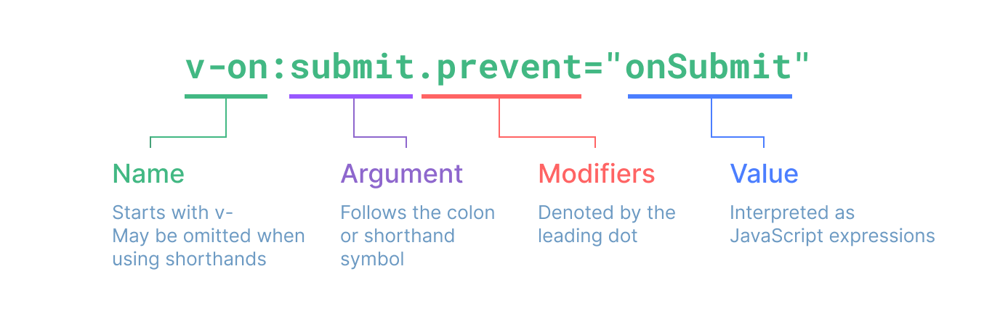

# 模板语法

## 模板

### 模板的概念

Q: 什么是模板？

A: 由Vue解析的HTML字符串

Vue的主要工作

1. 编译模板
2. 挂载

### 模板的确定

确定模板有几种方式

1. 没有指定`template`选项, 以容器的`innerHTML`做为模板
2. 指定`template`选项, 以`template`选项做为模板
3. 指定`render`选项, 以`render`函数做为模板

**优先级**

render函数 > template > 容器

意思就是同时使用，仅最高优先级生效

#### 容器内模板

当未设定template选项和render选项时

```html
<!-- 根组件的模板通常是组件本身的一部分，但也可以直接通过在挂载容器内编写模板来单独提供 -->
<div id="app">{{msg}}</div>
```

#### template选项

是一个属性

template选项就是确定模板字符串的

```js
const app = createApp({
    data() {
        return {
            msg: 'hello world',
        }
    },
    // template选项就是确定模板字符串的
    // 优先级: template > 容器
    template: `
          <div>
            <h1>template选项指定的内容</h1>
            <p>{{msg}}</p>
          </div>
        `,
})
```

#### render选项

是一个方法

render配置项也可以指定模板字符串. template字符串, 在vue的内部会编译成render函数

如果设置了render选项, 就直接使用render函数的返回值作为模板

在调用render函数时, 会产生虚拟DOM(简化版的DOM树)(Vnodes)

Vue 提供了一个 h() 函数用于创建 vnodes

```js
// Vue 提供了一个 h() 函数用于创建 vnodes
const { createApp, h } = Vue
···
···
const app = createApp({
    data() {
        return {
            msg: 'hello world',
        }
    }
    // render函数 > template > 容器
    // render配置项也可以指定模板字符串. template字符串, 在vue的内部会编译成render函数
    render() {
    // 如果设置了render选项, 就直接使用render函数的返回值作为模板
    // 在调用render函数时, 会产生虚拟DOM(简化版的DOM树)(Vnodes)
    // <div><h1>hello</h1> <p>world</span></p>
    return h('div', [h('h1', 'hello'), h('p', 'world')])
},
})
```

#### Vue工作流程

1. 确定模板(render/template/容器)
2. 编译模板: 将template的字符串 编译成 render函数
3. 调用render函数, 返回 虚拟DOM(VDom/VNode) 对象
4. 根据 虚拟DOM 生成 真实DOM, 替换 挂载点(由mount的参数指定的)

## 模板语法

#### 概念

在模板字符串中, 具有特殊意义的**语法**

#### 分类

**模板语法分为**

- 插值语法: 在`{{}}`中书写的语法
- 指令语法: 以`v-`开头的语法

### 插值语法

#### 概念

插值语法 (Mustache)

在{{}}中书写的语法

{{}}里书写js表达式, 叫做 插值表达式

#### 应用

主要应用于文本节点

#### 语法

```html
<div id="app">
  {{msg}}
</div>
```

#### 使用

##### 直接使用实例上的属性

在`{{}}`内, 可以直接访问当前实例上的属性和方法

##### 使用表达式

在`{{}}`内, 可以书写js表达式, 但是不能书写语句

##### 示例

```html
<div id="app">
    <!-- 表达式本身有返回值 -->
    {{ (()=>{ if(msg) {return msg} else {return 'aaa'} })() }} {{$.data}}
    <!-- {{if (msg) {return msg} }} 是错误的, 这是if语句 -->
</div>
<!-- 创建app实例 -->
<script>
    const { createApp } = Vue
    const app = createApp({
        data() {
            return {
                msg: 'hello world',
            }
        },
    })
    const instance = app.mount('#app')
    console.dir(instance)
</script>
```

**单一表达式**，也就是一段能够被求值的 JavaScript 代码。一个简单的判断方法是是否可以合法地写在 `return` 后面

### 指令语法

#### 概念

指令(Directives)

以`v-`开头

在属性值中书写js表达式, 叫做 指令表达式

#### 语法

```html
<a v-bind:href="url">百度</a>
```



- 指令名
  - 以`v-`开头
- 参数 Arguments
  - 在指令名后通过一个`:`隔开做标识，不包括`:`
- 修饰符 Modifiers
  - 以`.`开头的，包括`.`
- 指令值
  - 前面通过`=`隔开，包裹在`" "`中

#### 应用

主要应用于属性节点

也可用于事件绑定

### 属性绑定

#### 概念

> 属性绑定
>
> 将 一个元素 的一个属性值和一个状态(变量)绑定

如果要将某一个属性的值和data中的状态绑定, 需要使用绑定指令

##### 注意

绑定的是html元素标签上的属性

#### 使用

v-bind 指令指示 Vue 将元素的 href attribute 与组件的 url 属性保持一致。

如果绑定的值是 null 或者 undefined，那么该 attribute 将会从渲染的元素上移除。 

```html
<div id="app">
    <a v-bind:href="url">模板语法</a>
</div>
<!-- 创建app实例 -->
<script>
    const { createApp } = Vue
    const app = createApp({
        data() {
            return {
                url: 'https://cn.vuejs.org/guide/essentials/template-syntax',
            }
        },
    })
    const instance = app.mount('#app')
    console.dir(instance)
</script>
```

##### 简写

因为 v-bind 非常常用，我们提供了特定的简写语法

```html
<div :href="url"></div>
```

##### 注意

在指令后面的引号中, 可以使用类似于{{}}中一样的语法.

- 可以使用 js表达式
- 直接访问instance实例上的属性和方法
- 不能是js语句

### 事件绑定

#### 概念

将JS事件和对应的处理函数绑定

类似于原生的JS事件处理

#### 语法

1. 内联事件处理器
v-on:事件名="表达式"
2. 方法事件处理器
v-on:事件名="函数名"
3. 简写
@事件名="表达式/函数名"

#### 使用

```html
1. 内联事件处理器: 逻辑比较简单时使用
2. 方法事件处理器: 逻辑复杂时, 事件对应到一个方法    
   - methods中定义的函数会挂载到instance实例对象上
   - methods中定义的普通函数内部this指向instance
   - methods中, 不推荐使用箭头函数
```

```html
<div id="app">
    <button v-on:click="count++">点击了{{count}}次</button>
    <button @click="count++">点击了{{count}}次</button>
    <button @click="add">点击了{{count}}次</button>
</div>
<!-- 创建app实例 -->
<script>
    const { createApp } = Vue
    const app = createApp({
        data() {
            return {
                count: 0,
            }
        },
        methods: {
            add() {
                this.count++
                console.log('你使用了方法事件处理器')
            },
        },
    })
    const instance = app.mount('#app')
    console.dir(instance)
</script>
```

#### 传参的细节

处理函数要不要加括号呢？如果加括号参数怎么传？

- 不加括号(70%): 直接写函数名称, 可以在回调函数中, 直接拿到事件对象event
- 加括号(20%): 加括号主要为了传参, 在回调函数中, 拿到参数
- 加括号(10%): 有时, 除了拿到参数外, 还需要事件对象, 通过Vue的内置事件对象$event传递
  $event要放在实参列表最后

```html
<div id="app">
    <!-- 不加括号(70%): 直接写函数名称, 可以在回调函数中, 直接拿到事件对象event -->
    <button @click="add1">点击了{{count}}次</button>
    <!-- 加括号(20%): 加括号主要为了传参, 在回调函数中, 拿到参数 -->
    <button @click="add2(1,2,3)">点击了{{count}}次</button>
    <!-- 
        加括号(10%): 有时, 除了拿到参数外, 还需要事件对象, 通过Vue的内置事件对象$event传递
        $event要放在实参列表最后
	-->
    <button @click="add3(1,2,3,$event)">点击了{{count}}次</button>
</div>
<!-- 创建app实例 -->
<script>
    const { createApp } = Vue
    const app = createApp({
        data() {
            return {
                count: 0,
            }
        },
        methods: {
            add1(event) {
                this.count++
                console.log(event)
            },
            add2(num1, num2, num3) {
                console.log([num1, num2, num3])
            },
            // event形参放在参数列表最后
            add3(num1, num2, num3, event) {
                console.log(num1, num2, num3)
                console.log(event)
            },
        },
    })
    const instance = app.mount('#app')
     </script>
```

访问事件参数也可以使用内联箭头函数

```html
<!-- 使用特殊的 $event 变量 -->
<button @click="warn('Form cannot be submitted yet.', $event)">
  Submit
</button>

<!-- 使用内联箭头函数 -->
<button @click="(event) => warn('Form cannot be submitted yet.', event)">
    Submit
</button>
```

#### 事件修饰符

在绑定事件的时候, 可以添加事件修饰符, 常用的事件修饰符如下:

- `.prevent`: 阻止默认行为
- `.stop`: 阻止冒泡
- `.once`: 事件只会触发一次

```html
<div id="app">
    <!-- 阻止默认行为 -->
    <a :href="ref" @click.prevent>被阻止跳转的链接</a>
    <!-- 阻止事件冒泡 -->
    <ul @click="ulFn">
        <li @click.stop="liFn">阻止事件冒泡的li</li>
        <li @click="liFn">不阻止事件冒泡的li</li>
    </ul>
    <!-- 只触发一次 -->
    <button @click.once="pay">仅首次点击可支付成功</button>
</div>
<!-- 创建app实例 -->
<script>
    const { createApp } = Vue
    const app = createApp({
        data() {
            return {
                ref: 'https://www.baidu.com',
            }
        },
        methods: {
            ulFn() {
                console.log('ul的点击事件监听器触发了')
            },
            liFn() {
                console.log('li的点击事件监听器触发了')
            },
            pay() {
                console.log('首次点击,支付成功. 之后不再支付')
            },
        },
    })
    const instance = app.mount('#app')
     </script>
```

注意: 修饰语可以使用链式书写，但需要注意调用顺序，因为相关代码是以相同的顺序生成的

#### 按键修饰符

在监听键盘事件时，我们经常需要检查特定的按键。Vue 允许在 `v-on` 或 `@` 监听按键事件时添加按键修饰符。

##### 普通按键

- `.enter`
- `.tab`
- `.delete` (捕获“Delete”和“Backspace”两个按键)
- `.esc`
- `.space`
- `.up`
- `.down`
- `.left`
- `.right`

##### 系统按键

你可以使用以下系统按键修饰符来触发鼠标或键盘事件监听器，只有当按键被按下时才会触发。

- `.ctrl`
- `.alt`
- `.shift`
- `.meta`
  - 在 Mac 键盘上，meta 是 Command 键 (⌘)。在 Windows 键盘上，meta 键是 Windows 键 (⊞)。在 Sun 微机系统键盘上，meta 是钻石键 (◆)。

请注意，系统按键修饰符和常规按键不同。与 keyup 事件一起使用时，该按键必须在事件发出时处于按下状态。

换句话说，keyup.ctrl 只会在你仍然按住 ctrl 但松开了另一个键时被触发。若你单独松开 ctrl 键将不会触发。

```html
<div id="app">
    <input type="text" @keyup.enter="handleInput" />
    <br />
    <!-- 系统按键修饰符 -->
    <!-- 
        请注意，系统按键修饰符和常规按键不同。与 keyup 事件一起使用时，该按键必须在事件发出时处于按下状态。
        换句话说，keyup.ctrl 只会在你仍然按住 ctrl 但松开了另一个键时被触发。若你单独松开 ctrl 键将不会触发。
	-->
    <input type="text" @keyup.ctrl="handleInput2" />
    <br />
    <!-- 
        指定松开的普通按键
	-->
    <input type="text" @keyup.ctrl.enter="handleInput3" />
    <br />
</div>
<!-- 创建app实例 -->
<script>
    const { createApp } = Vue
    const app = createApp({
        methods: {
            handleInput(e) {
                console.log(e)
                console.log('看到我说明你按下然后松开了enter键')
            },
            handleInput2() {
                console.log('必需按住ctrl并松开了其他键触发')
            },
            handleInput3() {
                console.log('必需按住ctrl并松开了enter键触发')
            },
        },
    })
    const instance = app.mount('#app')
     </script>
```

指定松开的普通按键

```html
<input type="text" @keyup.ctrl.enter="handleInput3" />
```

###### `.exact` 修饰符

`.exact` 修饰符允许精确控制触发事件所需的系统修饰符的组合。

```html
<!-- 当按下 Ctrl 时，即使同时按下 Alt 或 Shift 也会触发 -->
<button @click.ctrl="onClick">A</button>

<!-- 仅当按下 Ctrl 且未按任何其他键时才会触发 -->
<button @click.ctrl.exact="onCtrlClick">A</button>

<!-- 仅当没有按下任何系统按键时触发 -->
<button @click.exact="onClick">A</button>
```

##### 鼠标按键修饰符

- `.left`
- `.right`
- `.middle`

这些修饰符将处理程序限定为由特定鼠标按键触发的事件。

### 双向绑定指令

**双向绑定指令** 通常应用于 **表单元素**

- 数据的改变 会 影响视图
- 视图的改变 会 影响数据

表单元素, 如`input` `select` `textarea`是具有交互性的: **用户可以操作**

当用户操作时, 会触发特定的`事件`如: `input事件` `change事件`

在事件处理的回调中, 可以对数据进行修改

#### 基本示例

-    :value将视图绑定到数据, 实现了数据->视图
-    @input将数据绑定到视图, 实现了视图->数据

```html
<div id="app">
    <!-- 
        :value将视图绑定到数据, 实现了数据->视图
        @input将数据绑定到视图, 实现了视图->数据
	-->
    在这里输入的内容会显示在下面:<input type="text" :value="msg" @input="setMsg" />
    <h3>{{msg}}</h3>
</div>
<!-- 创建app实例 -->
<script>
    const { createApp } = Vue
    const app = createApp({
        data() {
            return {
                msg: '123',
            }
        },
        methods: {
            setMsg(e) {
                // e.target 正在操作的输入框
                // e.target.value:获取到的property,表示用户在框中输入的数据
                this.msg = e.target.value
            },
        },
    })
    const instance = app.mount('#app')
    console.dir(instance)
</script>
```

#### 简写指令

`v-model` 还可以用于各种不同类型的输入，`<textarea>`、`<select>` 元素。它会根据所使用的元素自动使用对应的 DOM 属性和事件组合：

- 文本类型的 `<input>` 和 `<textarea>` 元素会绑定 `value` property 并侦听 `input` 事件；
- `<input type="checkbox">` 和 `<input type="radio">` 会绑定 `checked` property 并侦听 `change` 事件；
- `<select>` 会绑定 `value` property 并侦听 `change` 事件。

注意

`v-model` 会忽略任何表单元素上初始的 `value`、`checked` 或 `selected` attribute。它将始终将当前绑定的 JavaScript 状态视为数据的正确来源。你应该在 JavaScript 中使用`data`选项来声明该初始值。

```html
<div id="app">

    <!-- 在这里输入的内容会显示在下面:<input type="text" :value="msg" @input="setMsg" /> -->
    <!-- 上边的简写如下 -->
    在这里输入的内容会显示在下面:<input type="text" v-model="msg" />
    <h3>{{msg}}</h3>
</div>
<!-- 创建app实例 -->
<script>
    const { createApp } = Vue
    const app = createApp({
        data() {
            return {
                msg: '123',
            }
        },
        // methods: {
        //   setMsg(e) {
        //     // e.target 正在操作的输入框
        //     // e.target.value:获取到的property,表示用户在框中输入的数据
        //     this.msg = e.target.value
        //   },
        // },
    })
    const instance = app.mount('#app')
    console.dir(instance)
</script>
```

# 补充知识

## PointerEvent

**PointerEvent** 接口代表了由 *指针* 引发的 DOM 事件的状态，包括接触点的位置，引发事件的设备类型，接触表面受到的压力等。

*指针* 是输入设备的硬件层抽象（比如鼠标，触摸笔，或触摸屏上的一个触摸点）*。指针 能指向一个具体表面（如屏幕）上的一个（或一组）坐标。*

### e.target的指向

指针的 *击中检测* 指浏览器用来检测 指针事件的目标元素的过程。大多数情况下，这个目标元素是由 指针的位置和元素在文章中的位置和分层共同决定的。

#### 最普通的状态

点击li01会触发两个监听器，e.target都是li01

点击li02，仅触发ul01的监听器，e.target是li02

点击li之外的，ul的部分，仅触发ul01的监听器，e.target是ul01

```html
<body>
    <ul id="ul01">
        <li id="li01">1111</li>
        <li id="li02">2222</li>
        <li id="li03">3333</li>
    </ul>
    <script>
        document.querySelector('#li01').addEventListener('click', function (e) {
            console.log('li01的监听器:')
            console.log(e)
            console.log(e.target)
            console.log(e.currentTarget)
        })
        document.querySelector('#ul01').addEventListener('click', function (e) {
            console.log('ul01的监听器:')
            console.log(e)
            console.log(e.target)
            console.log(e.currentTarget)
        })
    </script>
```

同时点击了父元素和子元素，e.target就是子元素，事件冒泡就从这里开始。

#### 把三个li叠在一块

```css
li {
    position: absolute;
} 
```

这时候按照定位的层叠关系，li03>li02>li01>ul01

ul01的高度已经塌陷了，指针不可能落在ul01范围内。

li03完全遮住了li01。

此时鼠标点击li区域，会命中谁呢？

答案是命中li03，触发事件沿dom树冒泡到ul01，触发ul01的监听器。e.target是li03

li01没有被命中

#### 总结

鼠标点击时，指针会开始命中测试（Hit Testing），检查指针所在的页面坐标与哪元素的边界区域重叠，通常基于元素的实际显示区域（包括元素的大小、位置、透明度、`z-index` 等因素）来确定。

命中测试成功的第一个元素即为事件的 `target` 对象。这通常是视觉上最靠前的、在用户点击或触摸位置的那个元素

如果目标元素位于另一个元素的内部（即它是子元素），那么这个子元素就是 `target`。如果事件没有命中任何子元素，最靠近的父元素会成为 `target`。

命中后，开始冒泡

## 事件冒泡

从e.target开始，沿dom树冒泡

## attribute和property的区别

property是dom对象的属性

attribute是html元素标签上的属性

```html
<input type="text" name="" id="ipt" value="123" />
<script>
    const ipt = document.querySelector('#ipt')
    // property是dom对象的属性
    // attribute是html元素标签上的属性

    // 随着用户输入而变化,初始值是标签的value attribute所设置的
    console.log(ipt.value)
    // 获取标签的value attribute所设置的值
    console.log(ipt.getAttribute('value'))

    // 修改dom对象的属性
    ipt.value = 456
    // 修改标签上的属性
    ipt.setAttribute('value', 234)
</script>
```

Vue的v-bind 指令绑定的是attribute

Vue的v-on事件处理器中修改的e.target的属性是property

# 作业总结

### 不使用v-model指令实现表单元素的双向绑定

```html
<form action="" id="form">
    <!-- 类型一：input:text、input:password、textarea -->
    <label for="username">用户名: </label>
    <input
           type="text"
           name="username"
           id="username"
           :value="username"
           @input="changeUsername"
           required
           />
    <br />
    <label for="password">密码: </label>
    <input type="password" name="password" id="password" v-model="password" required />
    <br />
    <label for="age">年龄: </label>
    <input type="text" name="age" id="age" v-model="age" required />
    <br />
    <!-- input:radio类型的双向绑定 -->
    <label>性别: </label>
    <input
           type="radio"
           name="gender"
           id="male"
           value="male"
           :checked="picked=='male'"
           @change="changePicked"
           />
    <label for="male">男</label>
    <input
           type="radio"
           name="gender"
           id="female"
           value="female"
           :checked="picked=='female'"
           @change="changePicked"
           />
    <label for="female">女</label>
    <br />
    <!-- input:checkbox类型的双向绑定 -->
    <label>爱好</label>
    <input
           type="checkbox"
           name="hobby"
           id="eat"
           value="eat"
           :checked="checked.includes('eat')"
           @change="changeChecked"
           />
    <label for="eat">吃饭</label>
    <input
           type="checkbox"
           name="hobby"
           id="sleep"
           value="sleep"
           :checked="checked.includes('sleep')"
           @change="changeChecked"
           />
    <label for="sleep">睡觉</label>
    <br />
    <!-- select类型的双向绑定 -->
    <label for="city">城市</label>
    <select name="city" id="city" :value="selected" @change="changeSelected">
        <option value="wuhan">武汉</option>
        <option value="zhengzhou">郑州</option>
        <option value="beijing">北京</option>
    </select>
    <br />
    <label for="signature">个人签名: </label>
    <textarea name="signature" id="signature" v-model="signature"></textarea>
</form>
<script>
    const { createApp } = Vue
    const app = createApp({
        data() {
            return {
                username: 'admin',
                password: '666666',
                age: '20',
                picked: 'male',
                checked: [],
                selected: 'wuhan',
                signature: '武汉中地',
            }
        },
        methods: {
            changeUsername(e) {
                this.username = e.target.checked
            },
            changePicked(e) {
                this.picked = e.target.value
            },
            changeChecked(e) {
                if (this.checked.includes(e.target.value)) {
                    this.checked = this.checked.filter(item => item != e.target.value)
                } else {
                    this.checked.push(e.target.value)
                }
            },
            changeSelected(e) {
                this.selected = e.target.value
            },
        },
    })
    app.mount('#form')
</script>
```

### 计算器

对结果输入框设置双向绑定，手动修改结果输入框的值时更新状态

否则，手动修改后，状态值不会改变，再点击等号按钮，状态没有发送变化，结果输入框的值不会更新

```html
<div id="calc">
    <input type="text" v-model="num1" />
    <select v-model="operator">
        <option>+</option>
        <option>-</option>
        <option>*</option>
        <option>/</option>
        <option>%</option>
    </select>
    <input type="text" v-model="num2" />
    <button @click="calculate">=</button>
    <!-- 
    设置双向绑定，手动修改结果输入框的值时更新状态 
    否则，手动修改后，状态值不会改变，再点击等号按钮，状态没有发送变化，结果输入框的值不会更新
    -->
    <input type="text" v-model="result" />
</div>
<script>
    const { createApp } = Vue
    const app = createApp({
        data() {
            return {
                num1: '',
                num2: '',
                operator: '+',
                result: '',
            }
        },
        methods: {
            calculate() {
                switch (this.operator) {
                    case '+':
                        this.result = +this.num1 + +this.num2
                        break
                    case '-':
                        this.result = this.num1 - this.num2
                        break
                    case '*':
                        this.result = this.num1 * this.num2
                        break
                    case '/':
                        this.result = this.num1 / this.num2
                        break
                    case '%':
                        this.result = this.num1 % this.num2
                        break
                }
            },
        },
    })
    app.mount('#calc')
</script>
```

