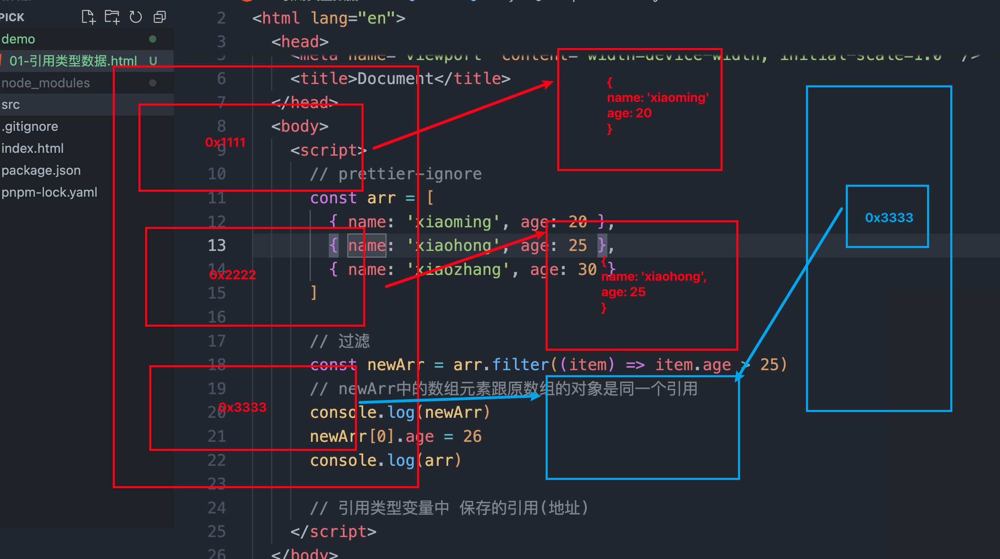

## git基础

### 记录每次更新到仓库

#### 查看已暂存和未暂存的修改

查看尚未暂存的文件更新了哪些部分

```bash
git diff
```

查看已经暂存起来的变化

```bash
git diff --cached
git diff --staged
```

## 引用数据类型

对象是引用数据类型,变量保存的是指向实际数据的引用

```js
      const arr = [
        { name: '张三', age: 18 },
        { name: '李四', age: 19 },
        { name: '王五', age: 20 },
      ]
      const newArr = arr.filter(item => item.age === 20)
      //   newArr中的元素和原数组的对象元素是同一个引用
      console.log(newArr)
      newArr[0].age = 24
      console.log(arr)
      //   引用类型变量中,保存的是引用(地址)
```

