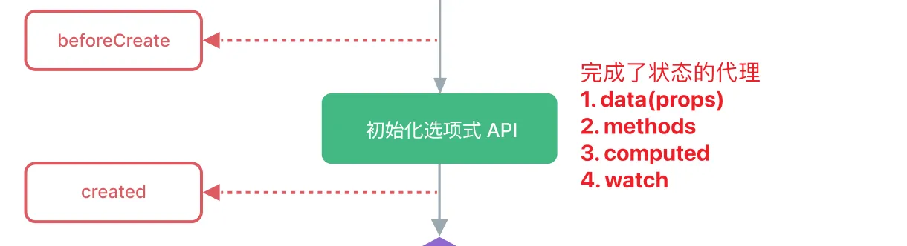
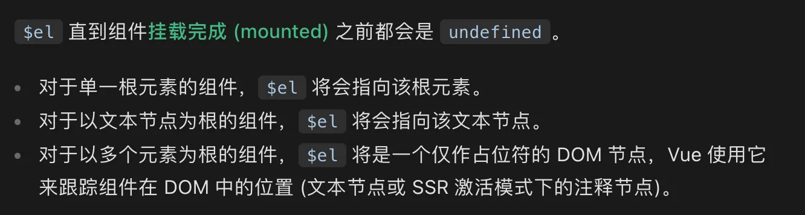
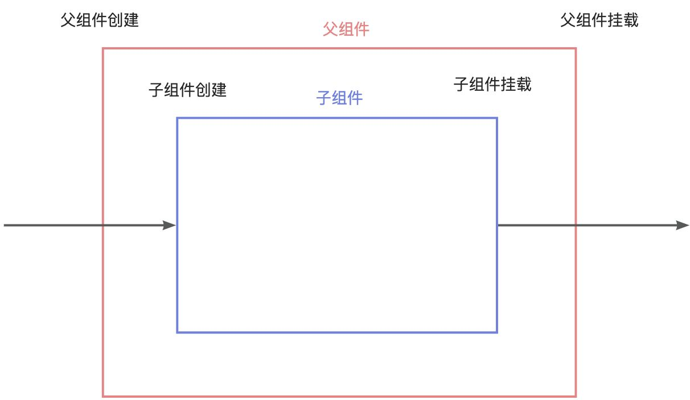
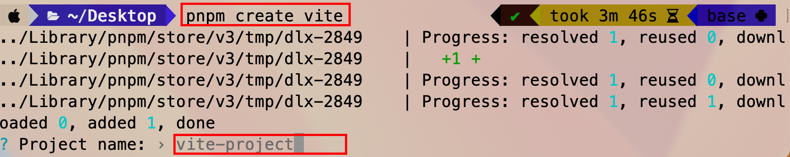
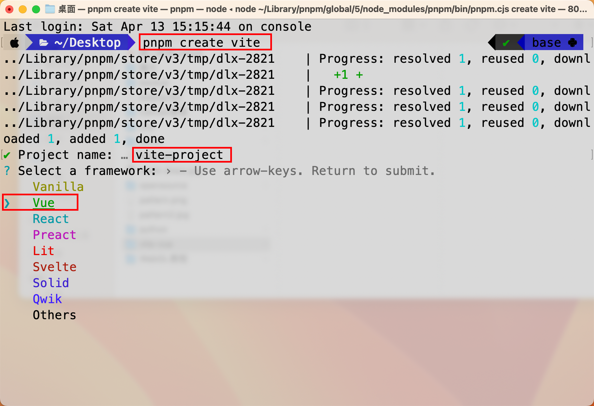

# 生命周期

**组件实例**从**创建**到**销毁**的整个过程

## 生命周期钩子

每个 Vue 组件实例在创建时都需要经历一系列的初始化步骤，比如**设置好数据侦听**，**编译模板**，**挂载实例到 DOM**，以及**在数据改变时更新 DOM**。在此过程中，它也会运行被称为生命周期钩子的函数，让开发者有机会在特定阶段运行自己的代码。

又被习惯性成为生命周期函数, 在生命周期过各中, 特定的时间点会被自动执行的函数


```html
    <div id="app">{{msg}}</div>
    <script>
      const { createApp } = Vue
      const app = createApp({
        data() {
          return {
            msg: 'hello',
          }
        },
        //创建阶段(初始化阶段)
        beforeCreate() {
          console.log('beforeCreate', this.msg, this.$el)
        },
        created() {
          console.log('created', this.msg, this.$el)
        },
        // 挂载阶段(渲染阶段)
        beforeMount() {
          console.log('beforeMount')
        },
        mounted() {
          console.log('mounted')
        },
        // 更新阶段
        beforeUpdate() {
          console.log('beforeUpdate')
        },
        updated() {
          console.log('updated')
        },
        // 卸载阶段
        beforeUnmount() {
          console.log('beforeUnmount')
        },
        unmounted() {
          console.log('unmounted')
        },
      })
      app.mount('#app')
    </script>
```

1. 当调用`app.mount`时, 会触发`created`和`mounted`
2. 当数据更新时, 会触发`updated`
3. 当调用`app.unmount`时, 会触发`unmounted`

## 生命周期阶段

### 创建阶段

以下内容已经设置完成：响应式数据、计算属性、方法和侦听器。

然而，此时挂载阶段还未开始，因此 $el 属性仍不可用



将状态代理到`当前组件`实例对象上

```html
    <div id="app">{{msg}}</div>
    <script>
      const { createApp } = Vue
      const app = createApp({
        data() {
          return {
            msg: 'hello',
          }
        },
        //创建阶段(初始化阶段)
        beforeCreate() {
          console.log('beforeCreate', this.msg, this.$el) //beforeCreate undefined null
        },
        created() {
          console.log('created', this.msg, this.$el) //created hello null
        },
      })
      app.mount('#app')
    </script>
```

此过程中使用了代理对象(proxy), vue的响应式就是在代理对象中实现的。this指向通过bind绑定到了代理对象

这一阶段实现了vue四大核心之一的响应式数据

### 挂载阶段

1. 将template选项指定的模板, 编译成render函数

2. 调用render函数, 得到虚拟dom

3. 根据虚拟dom生成真实dom

4. 替换由$el指定的dom

由虚拟dom到真实dom需要通过渲染器实现

```html
    <div id="app">{{msg}}</div>
    <script>
      const { createApp } = Vue
      // 挂载:
      // 1. 将template选项指定的模板, 编译成render函数
      // 2. 调用render函数, 得到虚拟dom
      // 3. 根据虚拟dom生成真实dom
      // 4. 替换由$el指定的dom
      const app = createApp({
        data() {
          return {
            msg: 'hello',
          }
        },
        // 挂载阶段(渲染阶段)
        beforeMount() {
          console.log('beforeMount', this.$el)
        },
        mounted() {
          console.log('mounted', this.$el)
        },
      })
      app.mount('#app')
    </script>
```

这一阶段使用了vue四大核心之二的编译器和渲染器

#### mounted

1. 所有同步子组件已经完成挂载
2. 发送请求, 更新数据通常在这个阶段做



### 更新阶段

- **beforeUpdate**: 数据已经更新了, 但是dom还是旧的, 还没有更新
- **updated**: 数据和dom都更新完毕

```html
    <div id="app">{{msg}}</div>
    <script>
      const { createApp } = Vue
      const app = createApp({
        data() {
          return {
            msg: 'hello',
          }
        },
        // 更新阶段
        // 更新的函数执行N次, N>=0,
        // 在beforeUpdate中, 数据是新的, 页面还是旧的
        beforeUpdate() {
          console.log('beforeUpdate', this.msg)
          console.log(document.querySelector('#app').innerHTML)
        },
        // 在update中, 数据是新的, 页面也是新的
        updated() {
          console.log('updated', this.msg)
          console.log(document.querySelector('#app').innerHTML)
        },
      })
      const instance = app.mount('#app')
      setTimeout(() => {
        instance.msg = 'world'
      }, 1000)
    </script>
```

### 卸载阶段

1. 手动调用`app.unmount()`, 触发卸载
2. 切换组件`v-if`时

```html
    <div id="app">{{msg}}</div>
    <script>
      const { createApp } = Vue
      function handleClick(event) {
        console.log('x:', event.clientX, 'y:', event.clientY)
      }
      const app = createApp({
        data() {
          return {
            msg: 'hello',
          }
        },

        mounted() {
          document.addEventListener('click', handleClick)
        },

        // 卸载阶段
        beforeUnmount() {
          console.log('beforeUnmount')
        },
        unmounted() {
          // 回收资源
          console.log('unmounted')
          // 解绑全局事件
          document.removeEventListener('click', handleClick)
        },
      })
      const instance = app.mount('#app')
    </script>
```

#### unmounted

1. 回收资源
2. 解绑全局事件

## 多组件生命周期

洋葱圈模型: 先创建的后挂载, 后创建的先挂载

这种结构也叫作栈, 先进后出



```html
    <div id="app">
      {{msg}}
      <my-com></my-com>
    </div>
    <script>
      const { createApp } = Vue
      const app = createApp({
        data() {
          return {
            msg: 'hello',
          }
        },
        components: {
          MyCom: {
            template: '<div>这是MyCom组件</div>',
            created() {
              console.log('子组件创建')
            },
            mounted() {
              console.log('子组件挂载')
            },
          },
        },
        created() {
          console.log('父组件创建')
        },
        mounted() {
          console.log('父组件挂载')
        },
      })
      app.mount('#app')
    </script>
```

```
父组件创建
子组件创建
子组件挂载
父组件挂载
```

操作子组件的dom通常在父组件的mounted钩子里进行, 因为此时所有子组件都已完成挂载

前端框架模式: MVVM(Model View ModelView)(数据 视图 双向绑定)

# Vite与构建工具

## 集成工具

为了方便, 我们不用每次都重新构建, 可以使用vite集成工具

### 自定义构建

执行命令

```bash
pnpm create vite
```

第一步: 输入项目名称. 默认值`vite-project`, 可以不改



第二步: 选择`vue`框架



第三步: 使用`create-vue`自定义


执行这三个命令, 启动网页


# 补充知识

## proxy

proxy是ES6新增的一个功能, 基于普通对象, 创建代理对象

```js
      const obj = {
        name: '小明',
        age: 20,
      }
      const pObj = new Proxy(obj, {
        // 访问拦截器
        get(target, key) {
          // target是代理的原始对象 obj
          // key是访问的属性名, 是pObj的属性名
          // 只要访问pObj的属性, 就会触发get方法
          console.log('get方法被执行了, key是: ', key)
          // 将pObj和obj关联起来, 可以认为pObj和obj拥有相同的属性
          return target[key]
        },
        // 设置拦截器
        set(target, key, value) {
          // 只要设置pObj的任意属性名, 就会触发set方法
          // key是设置的属性名, value是设置的属性值
          console.log('set方法被执行了, key是 ', key, 'value是: ', value)
          // 设置obj的属性
          target[key] = value
          // vue中,在set方法中新增了更新dom的操作
          document.querySelector('#app').innerHTML = value
        },
      })

      // pObj对象存在任意的属性, 属性值由get方法的返回值确定

      // 要把 普通对象 => 响应式对象(proxy)
      // 由于响应式对象存在可自定义的set操作
      // 那么, 当set proxy对象的属性时, 就会触发set方法, 在set方法中就可以进行更新dom的操作
```

这就是vue响应性的简单实现

## 渲染器

在挂载阶段, 虚拟dom被渲染器渲染成真实dom

下方示例是一个超简易版的渲染器实现

```js
      // 模板(template或者容器innerHTML) => 编译器 => render函数 => 调用函数返回虚拟dom(vDom)
      // vDom => 渲染器 => 真实dom
      // 使用真实dom 替换掉 $el指定的挂载点
      const vDom = {
        tag: 'div',
        type: 1,
        children: [
          {
            tag: 'p',
            type: 1,
            children: [
              {
                tag: 'span',
                type: 1,
                children: [{ type: 3, text: 'vue' }],
              },
            ],
          },
          {
            tag: 'h2',
            type: 1,
            children: [{ type: 3, text: 'hello' }],
          },
        ],
      }

      function renderer(vdom) {
        let root = null
        if (vdom.type === 1) {
          root = document.createElement(vdom.tag) // 创建一个元素节点
          if (vdom.children) {
            vdom.children.forEach(child => {
              root.appendChild(renderer(child)) // 递归调用
            })
          }
        } else if (vdom.type === 3) {
          root = document.createTextNode(vdom.text) // 创建一个文本节点
        }
        // 返回真实dom
        return root
      }

      const realDom = renderer(vDom)
      console.log(realDom)
```

## ES6模块

### export 与 import的复合使用

export 与 import 可以在同一模块使用，使用特点：

- 可以将导出接口改名，包括 default。
- 复合使用 export 与 import ，也可以导出全部，当前模块导出的接口会覆盖继承导出的。

```js
export { foo, bar } from "methods";
 
// 约等于下面两段语句，不过上面导入导出方式该模块没有导入 foo 与 bar
import { foo, bar } from "methods";
export { foo, bar };
 
/* ------- 特点 1 --------*/
// 普通改名
export { foo as bar } from "methods";
// 将 foo 转导成 default
export { foo as default } from "methods";
// 将 default 转导成 foo
export { default as foo } from "methods";
 
/* ------- 特点 2 --------*/
export * from "methods";
```

