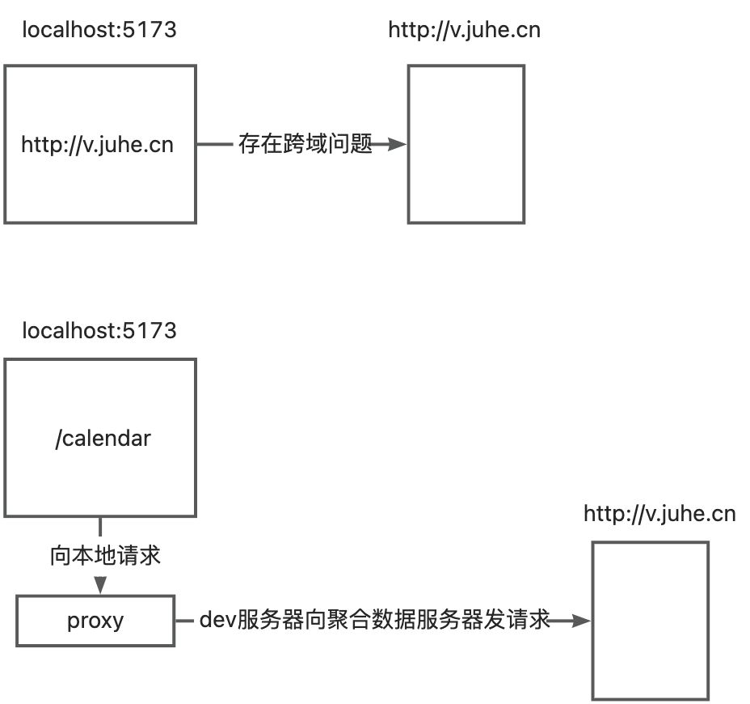

# Date

## Date() 构造函数

**`Date()`** 构造函数可以创建一个 [`Date`](https://developer.mozilla.org/zh-CN/docs/Web/JavaScript/Reference/Global_Objects/Date) 实例或返回代表当前时间的字符串。

### 语法

```js
new Date()
new Date(value)
new Date(dateString)
new Date(dateObject)

new Date(year, monthIndex)
new Date(year, monthIndex, day)
new Date(year, monthIndex, day, hours)
new Date(year, monthIndex, day, hours, minutes)
new Date(year, monthIndex, day, hours, minutes, seconds)
new Date(year, monthIndex, day, hours, minutes, seconds, milliseconds)

Date()
```

> **备注：**调用 `Date()` 时可以使用或不使用 [`new`](https://developer.mozilla.org/zh-CN/docs/Web/JavaScript/Reference/Operators/new)，但是它们有不同的效果。参见[返回值](https://developer.mozilla.org/zh-CN/docs/Web/JavaScript/Reference/Global_Objects/Date/Date#返回值)部分。

#### 参数

对于 Date() 构造函数，有五种基本的形式：

##### 无参数

当没有提供参数时，新创建的 `Date` 对象代表当前的日期和时间。

##### 时间或时间戳值

- `value`

  一个整数，代表自 UTC 1970 年 1 月 1 日 00:00:00（ECMAScript 纪元，与 UNIX 纪元相同）以来的毫秒数，忽略闰秒。请记住，大多数 [UNIX 时间戳](https://pubs.opengroup.org/onlinepubs/9699919799/basedefs/V1_chap04.html#tag_04_16)函数只精确到最近的秒。

##### 日期字符串

- `dateString`

  一个代表日期的字符串值，其格式由 [`Date.parse()`](https://developer.mozilla.org/zh-CN/docs/Web/JavaScript/Reference/Global_Objects/Date/parse) 方法所识别。（ECMA262 规范规定了 [ISO 8601 的简化版本](https://tc39.es/ecma262/#sec-date-time-string-format)，但其他格式可以由实现者定义，通常包括[符合 IETF 的 RFC 2822 时间戳](https://datatracker.ietf.org/doc/html/rfc2822#page-14)。）

**备注：**当用 `Date` 构造函数（和 `Date.parse`，它们是等价的）解析日期字符串时，一定要确保输入符合 ISO 8601 格式（`YYYY-MM-DDTHH:mm:ss.ssZ`），其他格式的解析行为是实现定义的，可能无法在所有浏览器上运行。对 [RFC 2822](https://datatracker.ietf.org/doc/html/rfc2822) 格式字符串的支持只是惯例。如果要适应许多不同的格式，库可以提供帮助。

仅有日期的字符串（例如 `"1970-01-01"`）被视为 UTC，而日期时间的字符串（例如 `"1970-01-01T12:00"`）被视为本地时间。因此，我们也建议你确保这两种类型的输入格式是一致的。

##### 日期对象

- `dateObject`

  一个现有的 `Date` 对象。这实际上是在现有的 `Date` 对象上复制了一个相同的日期和时间。这等同于 `new Date(dateObject.valueOf())`，除了不调用 `valueOf()` 方法。

当一个参数被传递给 `Date()` 构造函数时，`Date` 实例被特别处理。所有其他的值都被[转换为原始值](https://developer.mozilla.org/zh-CN/docs/Web/JavaScript/Data_structures#强制原始值转换)。如果结果是一个字符串，它将被解析为一个日期字符串。否则，产生的会被进一步强制转换为数值，并被视为时间戳。

##### 日期和时间组件的单独值

给出至少一个年份和月份，这种形式的 `Date()` 返回一个 `Date` 对象，其组成部分的值（年、月、日、小时、分钟、秒和毫秒）都来自以下参数。任何缺失的字段都被赋予可能的最低值（`day` 为 `1`，其他所有组件为 `0`）。这些参数值都是根据当地的时区，而不是 UTC 来评估的。

如果任何参数超过其定义的范围，会发生“进位”。例如，如果传入一个大于 `11` 的 `monthIndex`，这些月将导致年的递增；如果传入一个大于 `59` 的 `minutes`，`hours` 将相应递增，等等。因此，`new Date(1990, 12, 1)` 将返回 1991 年 1 月 1 日；`new Date(2020, 5, 19, 25, 65)` 将返回 2020 年 6 月 20 日凌晨 2:05。

类似的，如果任何参数不足其定义的范围，会从高位“借位”。例如，`new Date(2020, 5, 0)` 将返回 2020 年 5 月 31 日。

- `year`

  表示年的整数。从 `0` 到 `99` 的值映射了 `1900` 到 `1999` 年。其他值对应真实的年份。参见[示例](https://developer.mozilla.org/zh-CN/docs/Web/JavaScript/Reference/Global_Objects/Date#将两位数年份映射为_1900_-_1999_年)。

- `monthIndex`

  表示月份的整数，从代表一月的 `0` 开始到代表十二月的 `11` 结束。

- `day` 可选

  表示一个月中第几天的整数。默认为 `1`。

- `hours`可选

  表示一天中的小时数的整数值，在 `0` 到 `23` 之间。默认值为 `0`。

- `minutes` 可选

  表示时间的分钟段的整数值。默认为小时后的 `0` 分钟。

- `seconds` 可选

  表示时间的秒数段的整数值。默认为分钟后的 `0` 秒。

- `milliseconds`可选

  表示时间的毫秒段的整数值。默认为 `0` 毫秒的秒数。

#### 返回值

调用 `new Date()`（`Date()` 构造函数）会返回一个 [`Date`](https://developer.mozilla.org/zh-CN/docs/Web/JavaScript/Reference/Global_Objects/Date) 对象。如果调用无效的日期字符串，或者如果要构建的日期的 UNIX 时间戳小于 `-8,640,000,000,000` 或大于 `8,640,000,000,000` 毫秒，它会返回一个 `Date` 对象，其 [`toString()`](https://developer.mozilla.org/zh-CN/docs/Web/JavaScript/Reference/Global_Objects/Date/toString) 方法返回字面量字符串 `Invalid Date`。

调用 `Date()` 函数（没有 `new` 关键字）会返回当前日期和时间的字符串表示，就像 `new Date().toString()` 那样。调用 `Date()` 函数（没有 `new` 关键字）时给出的任何参数都会被忽略；无论调用的是一个无效的日期字符串，甚至使用任何任意对象或其他原始值作为参数，它总是返回一个当前日期和时间的字符串表示。

### “进位/借位”的应用

#### 场景一

使用参数的“借位”可以查询某年的某月有多少天。

比如要查询2024年9月有多少天：

```js
const lastDay = new Date(2024, 9, 0).getDate()
```

day指定为了0, 因为0小于day的最小可用参数1, 所以会向month借一位, 故实际输入参数是`(2024, 8, 31)`, 会获取表示2024年9月31日的时间对象。之后调用了`Date.prototype.getDate()`，返回表示第几天的整数（从 1--31）

#### 场景二

在根据当前月获取上个月和下个月有多少天时, 无需考虑本月是1月或12月时的边界情况。

例如当本月是一月, 则上个月的参数是`(2024, -1, 1)`, 此时monthIdex会向year借位, 变成`(2023, 11, 1)`

例如当本月是十二月, 则下个月的参数是`(2024, 13, 1)`, 此时monthIdex会向year进位, 变成`(2025, 0, 1)`

# Array

## Array.from()

**`Array.from()`** 静态方法从[可迭代](https://developer.mozilla.org/zh-CN/docs/Web/JavaScript/Reference/Iteration_protocols#可迭代协议)或[类数组](https://developer.mozilla.org/zh-CN/docs/Web/JavaScript/Guide/Indexed_collections#使用类数组对象)对象创建一个新的浅拷贝的数组实例。

转换[异步的可迭代](https://developer.mozilla.org/zh-CN/docs/Web/JavaScript/Reference/Iteration_protocols#异步迭代器和异步可迭代协议)对象到数组，可以使用 [`Array.fromAsync()`](https://developer.mozilla.org/zh-CN/docs/Web/JavaScript/Reference/Global_Objects/Array/fromAsync)。

### 语法

```js
Array.from(arrayLike)
Array.from(arrayLike, mapFn)
Array.from(arrayLike, mapFn, thisArg)
```

#### 参数

- `arrayLike`

  想要转换成数组的类数组或可迭代对象。

- `mapFn` 可选

  调用数组每个元素的函数。如果提供，每个将要添加到数组中的值首先会传递给该函数，然后将 `mapFn` 的返回值增加到数组中。使用以下参数调用该函数：[`element`](https://developer.mozilla.org/zh-CN/docs/Web/JavaScript/Reference/Global_Objects/Array/from#element)数组当前正在处理的元素。[`index`](https://developer.mozilla.org/zh-CN/docs/Web/JavaScript/Reference/Global_Objects/Array/from#index)数组当前正在处理的元素的索引。

- `thisArg`可选

  执行 `mapFn` 时用作 `this` 的值。

#### 返回值

一个新的[数组](https://developer.mozilla.org/zh-CN/docs/Web/JavaScript/Reference/Global_Objects/Array)实例。

### 描述

`Array.from()` 可以通过以下方式来创建数组对象：

- [可迭代对象](https://developer.mozilla.org/zh-CN/docs/Web/JavaScript/Reference/Iteration_protocols)（例如 [`Map`](https://developer.mozilla.org/zh-CN/docs/Web/JavaScript/Reference/Global_Objects/Map) 和 [`Set`](https://developer.mozilla.org/zh-CN/docs/Web/JavaScript/Reference/Global_Objects/Set) 对象）；或者，如果对象是不可迭代的，
- 类数组对象（带有 `length` 属性和索引元素的对象）。

`Array.from()` 绝不会创建稀疏数组。如果 `arrayLike` 对象缺少

### 使用

#### 获取连续的数字元素数组

```js
const getNumberArray = (start, end) => Array.from({ length: end - start + 1 }, (_, i) => i + start)
```

例如

```js
Array.from({ length: 12 }, (_, i) => i + 1)
```

即是获取长度为12的数组, 数组的每个元素是索引+1, 即元素是是1-12。

`mapFn`的第一个参数表示原本预计添加到数组的元素, 第二个参数表示元素的索引。返回值将添加到数组。因为本次用不到第一个参数, 所以用`_`做占位符

# 跨域请求问题

#### 什么是域

协议+主机+端口

eg. `http://localhost:5173`

#### 什么是跨域

1. 只要上述三个部分其中一个不一样, 就认为从A域到B域, 就会**跨域**
2. 只有浏览器在跨域请求时会报错

#### 如何解决浏览器的跨域问题

1. 在前端解决: 配置proxy代理
2. 在服务端解决: 开启CORS, 允许跨域请求



在使用公共接口时, 不能直接修改后端.

因此, 需要在前端配置proxy代理

修改`vite.config.js`的配置选项

```js
import { fileURLToPath, URL } from 'node:url'

import { defineConfig } from 'vite'
import vue from '@vitejs/plugin-vue'

// https://vitejs.dev/config/
export default defineConfig({
  plugins: [vue()],
  resolve: {
    alias: {
      '@': fileURLToPath(new URL('./src', import.meta.url)),
    },
  },
  // 添加devServer配置的选项. 设置代理
  server: {
    proxy: {
      '/calendar': {
        target: 'http://v.juhe.cn/',
        changeOrigin: true,
      },
    },
  },
})
```

此时发送请求

```js
axios.get(`/calendar/day?key=55f5a67a3&date=${formatDate}`)
```

请求会由本地代理服务器发出, url中的`/calendar`会被替换为`http://v.juhe.cn/`, 