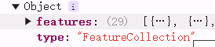
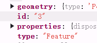
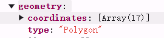

# 智慧交通项目总结

## geojson结构

将geojson字符串对象化后，会有两个属性，type和features



features属性值是一个数组，每个元素都是一个feature（要素）对象

feature对象的属性有id，type，geometry和properties



geometry（几何）对象，可以说是geojson的核心，它的type属性和coordinates属性描述了形状和位置



properties（属性）对象则记录了属性信息，一个标准的属性对象应该只包含key-value键值对

## openlayer

openlayer的feature并不是geojson规范的feature，在与其他地理工具，如turf交互时，就涉及格式转换的问题。为此ol提供了一个类用于格式转换

ol/format/GeoJSON

[ol/format/GeoJSON](https://openlayers.org/en/v5.3.0/apidoc/module-ol_format_GeoJSON.html)

### source/TileWMS

```js
const wmsLayer = new ol.layer.Tile()
const wmsSource = new ol.source.TileWMS({
  //WMS服务基地址
  url: wmsBaseLayerUrl.value('guanggu'),
  //图层等参数
  params: {
    LAYERS: 't0,t1,t2,t3,t4',
  },
  //服务类型
  serverType: 'geoserver',
  crossOrigin: 'anonymous',
})
wmsLayer.setSource(wmsSource)
map.addLayer(wmsLayer)
```

map可能是通过params查找以往的缓存来加载, 只要随便设置个属性能让params对象被区分就能解决地图不刷新导致的样式没有及时更新的问题

```js
  // 尝试刷新地图
  wsmSource.updateParams({
    // A: Math.random(),
    // map根据params查找缓存, 查不到就刷新,建立新缓存
    TIME: new Date().getTime(), //唯一性标识, 用于map区分params, 强制刷新缓存, 可以是任意无关属性名和值
  })
```

