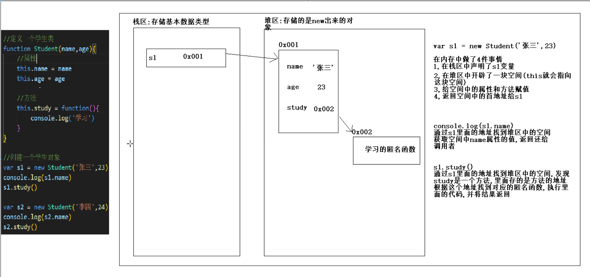

## 循环关键字

#### break

break 语句用于跳出循环。（结束当前循环）

break用在循环和switch中

应用场景：直接使用死循环,设置跳出条件寻break跳出

注意点：break只能结束它当前所在的一层循环

#### continue

continue 用于跳过循环中的一个迭代。（跳过本次循环，继续下一次循环）

continue只能用在循环中

## 数组

#### 什么是数组?

数组对象是使用单独的变量名来存储一系列的值。

数组可以用一个变量名存储所有的值，并且可以用变量名访问任何一个值。

数组中的每个元素都有自己的的ID，以便它可以很容易地被访问到。

#### 创建数组

创建一个数组，有三种方法。

下面的代码定义了一个名为 myCars的数组对象：

1: 常规方式:

​	先定义，再初始化

```js
var myCars=new Array();
myCars[0]="Saab";   
myCars[1]="Volvo";
myCars[2]="BMW";
```

2: 简洁方式:

​	定义时初始化

```js
var myCars=new Array("Saab","Volvo","BMW");
```

3: 字面量:

​      字面上的含义（[]代表数组，{}代表对象）

​      本质上还是使用new Array来创建的

```js
var myCars=["Saab","Volvo","BMW"];
```

#### 访问数组

通过指定数组名以及索引号码，你可以访问某个特定的元素。

以下实例可以访问myCars数组的第一个值：

```js
var name=myCars[0];
```

以下实例修改了数组 myCars 的第一个元素:

```js
myCars[0]="Opel";
```

[0] 是数组的第一个元素。[1] 是数组的第二个元素。

#### 修改数组

目前对数组的所有操作，都是通过它的索引来完成

```js
var arr=['aaaa','bbbb','cccc'] 
```

##### 新增

```js
 // 新增
arr[3]='dddd';
console.log(arr);
arr[5]='ffff'
console.log(arr);// arr[4]是空白
console.log(arr[4]);// undefined
```

##### 修改

```js
arr[2] = 'CCCC'
console.log(arr);
```

##### 查找

```js
// 取值：根据索引获取指定元素值
console.log(arr[2]);
// 长度：根据数组对象的一个属性length
console.log(arr.length);
```

##### 删除

```js
delete arr[1]
console.log(arr); // 删除之后数组长度没有变化，
console.log(arr[1]);// 被删的值变为undefined
```

#### 遍历数组

##### for循环

结合数组的length属性

```js
for(var i=0;i<arr.length;i++){
	console.log(arr[i]);
}
```

##### For/In 循环

```js
for(i in arr){
	console.log(arr[i]);
}
```

##### 比大小案例

```js
var arr = [11, 55, 22, 33, 44]
var sum = arr[0]; // 因为设置了循环是从1开始,直接访问数组的第二个元素,所以和的初始值取数据的第1个元素
// 擂台变量
var max = arr[0];   //为了确保初始值不比数组中所有元素的值大，取数组元素的值，一般取第一个
var min = arr[0];   //为了确保初始值不比数组中所有元素的值小，取数组元素的值，一般取第一个
for (i = 1; i < arr.length; i++) {
    sum += arr[i];
    // 其余元素和擂台元素比较，获胜的成为新的擂台元素
    // 因为擂台元素取的第一个值，所以初始循环建议从1开始，直接索引数组第二个值
    max = arr[i] > max ? arr[i] : max
    min = arr[i] < min ? arr[i] : min
}
var mean = sum / arr.length;
document.write(`和是${sum},平均值是${mean},最大值是${max},最小值是${min}<br>`)
```

##### 查找索引案例

查找元素首次出现的索引

```js
var arr = [11, 55, 22, 33, 44]
var num = +prompt('请输入数字');
// 定义一个索引来保存结果
var index = -1; //使用-1表示索引不存在
for (i in arr) {
    if (arr[i] == num) {
        index = i;
        break // 查到之后就停止匹配
    }
}
if (index == -1) {
    document.write(`数字中没有这个元素`)
} else{
    document.write(`要查找的数据在数组中第一次出现的索引为${index}`)
}

// 后续可以使用数组中的方法来实现（面向对象时的内容）
 document.write(`<br>要查找的数据在数组中第一次出现的索引为${arr.indexOf(num)}`)
```

#### 二维数组

##### 概念

本质也是一维数组，里面的每一个元素都是一个一维数组

##### 应用场景

```js
// 三个小组，每组3个学生，用数组保存每小组每个学生的成绩
var arr = [[1,2,3],[4,5,6],[7,8,9]]

// gis绘制多边形
	//多边形有多个点，每个点都有经纬度，使用二维数组保存多边形
var arr = [[1,2],[4,5],[7,8],[1,2]] //首尾坐标一样，形成封闭多边形
```

##### 访问

```js
// arr[]
document.write(`${arr[0]}<br>`);
// arr[][]
document.write(`${arr[0][0]}<br>`);
```

##### 遍历

嵌套循环

```js
for (i = 0; i < arr.length; i++) {
    for (j = 0; j < arr[i].length; j++) {
        document.write(arr[i][j])
    }
    document.write('<br>')
}
```

## 函数

##### 概念

封装了一段具有特定功能的代码块

##### 作用

方便用户重复调用

#### 基本形式

```js
// 声明函数
	// 函数名使用小驼峰命名法
    function 函数名(形参列表){
        函数体
    }

// 调用函数
	函数名(实参列表) // 规则：有参数就给，有返回就接
```

#### 参数

##### 概念

相当于一个媒介，调用这个可以通过它将要操作的数据传递到函数内部，进行运算

##### 做法

将函数体内变化的数据，提取出来，放到()里面，作为占位符（形式参数）

将来调用的时候，再用实际参数来替换形式参数，将值传递到函数内部

##### 分类

形式参数：写在函数定义语句的()中，占位符变量名，名字可以随意，在函数内部充当变量

实际参数：写在函数调用语句的()中，里面传递的是具体数据，赋值给形参

```js
function sum(num1,num2) {
    var sum1 = 0;
    while (num1 <= num2) {
        sum1 += num1;
        num1++;
    }
    return sum1;
    // 借助函数的返回值，在调用函数后拿到最终结果
}
```

##### 数组作为参数

形式参数：任意一个变量名

实际参数：可以传数组名，也可以传整个数组

#### 返回值

```js
return
// 可以将函数执行后的结果返回给调用者，方便调用者在外面接收
```

##### return的作用

1.可以将函数执行后的结果返回给调用者（后面跟要返回的值、变量或表达式）

2.用于结束函数（后面不跟任何东西）（return之后若有代码也不再执行）

#### 函数的分类

##### 命名函数

有名字

*调用*：使用函数名（有参数就给，有返回值就接）

##### 匿名函数

没名字

一般需要定义一个变量来接收这个匿名函数（此时变量名相当于函数名）

*调用*：使用变量名（有参数就给，有返回值就接）

```js
var f = function (num1, num2) {
    return num1 + num2;
}
document.write(f(1, 100));
```

 匿名函数本身经常作为参数进行传递

#### 注意点

1.如果函数里没有显式地调用return，那么函数就没有返回值。强行接收，会接收到undefined

2.函数名代表整个函数,类似数组名代表整个数组,因为它们都是对象类型

3.若实参个数小于形参个数，没有被赋值的形参的值就是undefined

4.若实参个数大于形参个数，多余的实参不会被传递

## 面向对象

#### 面向过程和面向对象

*面向过程*

完成一件事，需要多少个步骤

*面向对象*

完成一件事，需要多少个对象

#### 面向对象的思想

找对象，找不同的对象，找合适的对象，帮你做你应该去做的事

#### 类

对现实生活中具有相同属性和行为的一类事物的统称（抽象的，可以看作是模板）

#### 对象

就是现实生活中的一个具体存在（具体的，根据这个模板创建出来的真实存在的个体）

#### 类和对象的关系

类相当于模板，对象就是根据这个模型模板创建出来的一个个真实存在的个体

类中有什么，对象中就有什么，不会多也不会少

#### 类和对象存在的意义

通过代码来描述现实生活中的事物，进行编程（编程源于生活）

#### 类的三要素

类名

属性：事物特征

行为：事物功能

#### 对象的创建

##### 构造函数法

```js
//通过构造函数：构造函数的类名是大写开头（大驼峰命名法），使用new关键字调用
function 构造函数名(形式参数1,形式参数2){ 
    //属性
    	// 给类添加两个属性
        // 通过this关键字来添加（this指代以后创建的具体对象）
    this.属性名1 = 形参1
    this.属性名2 = 形参2
    
    //方法
    	// 通过this关键字来添加
    	// 方法一般是匿名函数
    this.方法名 = function(形式参数){
        // 函数体用到类的属性时，用this.属性名，而不是直接使用类的形参
        // 防止创建对象时未传参，调用方法时拿不到值
        函数体
    }
}
```

##### 对象的创建

```js
// 创建对象
var 对象名 = new 构造函数名(实际参数)  // 使用new关键字调用

// 获取属性
	//两种方法
对象名.属性名
对象名['属性名']

// 设置属性(修改属性)
对象名.属性名 = 新值

// 调用方法
对象名.方法名(实际参数)
```

