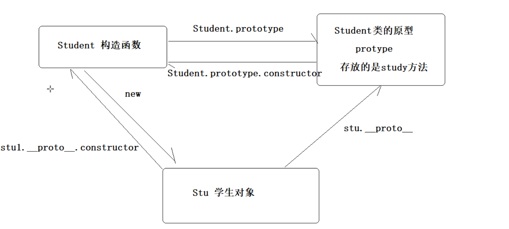
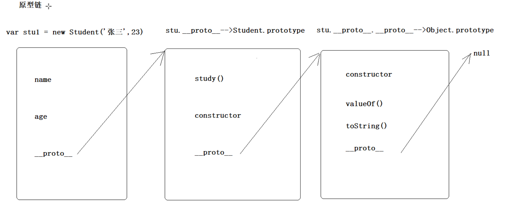

## 原型和this指向

### 原型对象Prototype

#### 概念

每一个构造函数里面都有一个属性prototype,习惯称之为原型对象(类的原型)

#### 作用

1. 共享方法:可以把一些公共的方法直接定义在原型对象中,所有对象的实例都可以共享这个方法。并且创建对象的时候,不会为这个方法重复开辟空间,可以节省内存

   ```js
   function Star(uname, age) {
       this.uname = uname;
       this.age = age;
   }
   Star.prototype.sing = function() {
   	console.log('我会唱歌');
   }
   var ldh = new Star('刘德华', 18);
   var zxy = new Star('张学友', 19);
   ldh.sing();//我会唱歌
   zxy.sing();//我会唱歌
   ```

   

2. 扩展方法:可以在不更改原有类的基础上,为类添加新的方法或者属性

#### 位置

在构造函数上(也可以认为在类上),通过打印构造函数可以看到

### 对象的原型

#### 概念

每一个实例对象都有一个属性(`__proto__`),指向构造函数的原型对象(prototype)
`__proto__`习惯称为对象的原型

```js
console.log(stu1.__proto__ === Student.prototype) //true  说明了对象的原型指向了构造函数的原型对象
```

#### 作用

主要为对象查找方法提供了一个机制(先从构造函数中找,如果找不到,再去它指向的原型对象中查找)

#### 位置

在对象上,可以通过打印对象就可以看到

#### 与原型对象对比

```js
function Student(name,age){
    //属性
    this.name = name
    this.age = age
}

//将方法定义在原型上
Student.prototype.study = function(){
    console.log('学习')
}

//创建两个对象
var stu1 = new Student('张三',23)
stu1.study()

var stu2 = new Student('李四',24)
stu2.study()

//原型对象(在构造函数上),本质是类的一个属性,每一个类都有
console.dir(Student)
console.log(Student.prototype)

//对象的原型(在对象上),本质是对象的一个属性,每一个对象都有
console.log(stu1)
console.log(stu1.__proto__)

//对象的原型指向原型对象(这两个其实是一个东西,只是站的角度不一样)
console.log(stu1.__proto__ === Student.prototype)//true
```


### 构造函数

#### 概念

不管是对象的原型`__proto__`,还是原型对象prototype,里面都有一个属性constructor
constructor一般称之为构造函数

```js
//constructor指向当前这个类的构造函数
console.log(Student.prototype.constructor === Student)//true
console.log(stu1.__proto__.constructor === Student)//true
```


#### 作用

主要用于创建对象,还可以记录该对象引用于哪一个构造函数

#### 位置

存在于原型对象prototype或者对象的原型`__proto__`的属性中

### 原型链

#### 概念

每一个实例对象都有一个`__proto__`属性,指向构造函数的原型对象,原型对象也是一个对象,也有
`__proto__`属性,指向上一层的原型对象,这样一层层往上找,就形成了原型链

#### 作用

当实例对象调用方法的时候,首先会在构造函数里面定义的方法去查找

如果没有的话,就会通过对象的`__proto__`找到原型对象,看原型对象中有没有定义

如果原型对象中也没有,就通过原型对象的`__proto__`找到上一层,看有没有定义这个方法

这样一层层往上找,一直找到Object,如果都没有,就报错





### 原型中的this指向

```js
function Student(name,age){
    //属性
    this.name = name
    this.age = age
    console.log('构造函数中的this:',this)//this代表创建出来的那个对象
}

//将方法定义在原型上
Student.prototype.study = function(){
    console.log('学习')
    console.log('原型对象中的this:',this)//this指向调用方法的那个对象(谁调用,代表谁)
}
```

## 函数进阶

### 函数的调用

```js
/* 1. 普通函数 */
function fn() {
	console.log('人生的巅峰');
}
 fn(); 
/* 2. 对象的方法 */
var o = {
  sayHi: function() {
  	console.log('人生的巅峰');
  }
}
o.sayHi();
/* 3. 构造函数*/
function Star() {};
new Star();
/* 4. 绑定事件函数*/
 btn.onclick = function() {};   // 点击了按钮就可以调用这个函数
/* 5. 定时器函数*/
setInterval(function() {}, 1000);  这个函数是定时器自动1秒钟调用一次
/* 6. 立即执行函数(自调用函数)*/
(function() {
	console.log('人生的巅峰');
})();
```

### 默认参数值

一般情况下，没有被赋值的形参的值就是undefined。

函数默认参数允许在没有值或 undefined 被传入时使用默认形参

#### 语法

```js
function [name]([param1[ = defaultValue1 ][, ..., paramN[ = defaultValueN ]]]) {
    statements
}
```

#### 描述

JavaScript 中函数的参数默认是 `undefined`。然而，在某些情况下可能需要设置一个不同的默认值。这是默认参数可以帮助的地方。

```js
function multiply(a, b = 1) {
  return a * b;
}

multiply(5, 2); // 10
multiply(5); // 5
```

#### 示例

##### 前面的参数可用于以后的默认参数

已经遇到的参数可用于以后的默认参数

```js
function greet(name, greeting, message = greeting + " " + name) {
  return [name, greeting, message];
}

greet("David", "Hi"); // ["David", "Hi", "Hi David"]
greet("David", "Hi", "Happy Birthday!"); // ["David", "Hi", "Happy Birthday!"]
```

##### 位于默认参数之后非默认参数

参数仍然设置为从左到右，覆盖默认参数，即使后面的参数没有默认值。

```js
function f(x = 1, y) {
  return [x, y];
}

f(); // [1, undefined]
f(2); // [2, undefined]
```

如果你只想改变某个非第一个参数，你需要通过 undefined 来跳过不需要更改的参数。

```js
function str(a = 1, b) {
    console.log(`${a},${b}`);
}
str() // 1,undefined
str(2) // 2,undefined
str(2,2) // 2,2
str(undefined) // 1,undefined
str(undefined,2) // 1,2
```

### 立即执行函数（IIFE）

第一部分是一个具有词法作用域的匿名函数，并且用圆括号运算符 () 运算符闭合起来。这样不但阻止了外界访问自执行匿名函数中的变量，而且不会污染全局作用域。

第二部分创建了一个立即执行函数表达式 ()，通过它，JavaScript 引擎将立即执行该函数。

**注意**：每个IIFE后都要有分号，防止影响影响下一个IIFE；前面也要有分号，防止被当作上一行的语句执行

```JS
//举例1:没有参数的立即执行函数
(function(){
    console.log('aaa')	// aaa
})();  //-----这个立即执行函数后面需要有分隔符; 否则会影响下一个立即执行函数
//举例2:有参数的立即执行函数
(function(num){
    console.log('aaa'+num)	// aaa100
})(100);
```

### this指向

- 在对象方法中，this 表示该方法所属的对象。
- 如果单独使用，this 表示全局对象。
- 在函数中，this 表示全局对象。
- 在函数中，在严格模式下，this 是未定义的(undefined)。
- 在事件中，this 表示接收事件的元素。
- 类似 call() 和 apply() 方法可以将 this 引用到任何对象。

### 如何查看方法/函数中的this指向

直接打印 this的值

### 改变this指向

#### call

**作用一**:

调用函数

格式:方法名.call(方法的调用者,参数列表)

**作用二**:

改变函数中this的指向(只需要修改方法的调用者即可)

```js
function getSum(num1,num2){
    console.log(this)
    return num1 + num2
}

//方式一:传统方式调用函数
var sum =  getSum(10,20) //this代表window
console.log(sum)

//方式二:使用call调用
//格式:方法名.call(方法调用者,参数列表)
var res = getSum.call(window,20,30)//this代表window
console.log(res)

//第二种方式可以实现this指向的改变,只需要对方法的调用者进行更换即可
var stu = {name:'张三',age:23}
var res1 = getSum.call(stu,20,30)//this就代表stu
console.log(res1)
```

​		

### 高阶函数

#### 概念

函数也是一个类型,也可以作为参数或者返回值,像这样的函数叫做高阶函数

也就是 参数或者返回值 是函数类型 函数,叫做高阶函数

#### 举例

Array中有很多方法,比如find(),filter(),every(),some(),reduce()等

它们都需要传递一个匿名函数,都是高阶函数

```js
/* 书写一个函数作为参数的案例 */

//定义一个参数是函数的函数
function f1(fn){
    fn()
}

//调用上面的函数(参数需要传递一个函数)
f1(function(){
    console.log('aaa')
})

/* 书写一个函数作为返回值的案例(提示:可以在函数内部定义一个函数并返回) */
function f2(){
    //定义一个函数并返回
    function inner(){
        console.log('bbb')
    }
    return inner
}

//调用上面的函数,需要接收它的返回值(返回的是一个函数)
var f = f2()
f()
```


## 闭包

#### 概念

一个函数,有权沿着作用域链访问另外一个函数作用域内的变量,而捕捉到变量的方式便是闭包。

```js
function f(){
    var num1 = 10
    function fn(){
        console.log(num1)
    }
    fn()
}
f() //10
```

#### 作用

1. 可以间接实现 在函数外面 访问 函数内部的 局部变量

   ```js
   //演示2:在函数外部无法读取函数内部的局部变量  
   function f2(){
       var b = 20
       //方式一:在函数的内部,再定义一个函数访问它内部的变量 ----  已经产生了闭包
       function f3(){
           console.log(b)
       }
       // 调用函数
       f3()
   }
   f2()
   ```

   ```js
   //演示2:在函数外部操作函数内部的局部变量
   function f2(){
       var b = 20
       //f3里面就封装的是对b变量的操作,可以将f3返回出去
       function f3(){
           b++
           console.log(b)
       }
       // 返回函数
       return f3
   }
   var f = f2()
   setInterval(f,1000)
   //闭包的另外一个作用
       //可以变相的延长局部变量的生命周期,变量b所在函数f2已经在`var f = f2()`这一行调用完了,
       //但是变量b仍然可以存在,直到程序结束
   ```

2. 也可以变相延长局部变量的生命周期,变量所在的函数调用完成之后,变量还可以继续存在

#### 应用场景

当我们需要重复使用某个变量,又想保护这个变量不被其他代码污染

