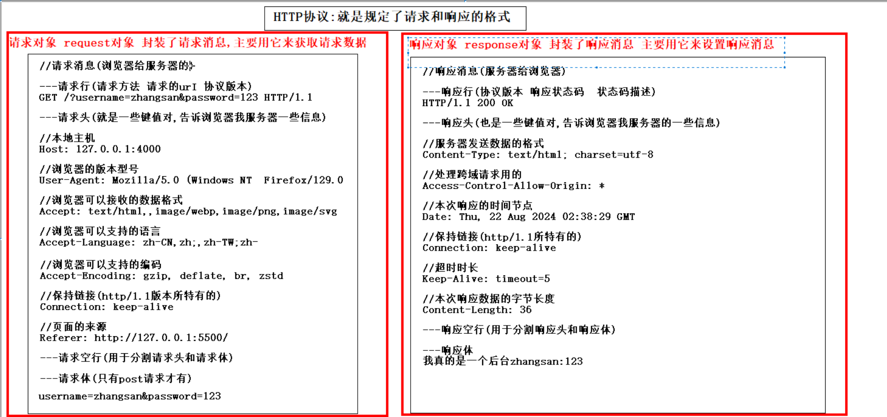

## 包的加载机制

### 步骤

1. node.js会假设它是一个内置模块，就回去系统的安装目录下查找
2. 如果不是内置模块，就回去当前目录下的node_modules下查找
   1. 首先看有没有该名字对应的文件，如果有，就直接加载这个文件
   2. 如果没有，就看是否有该名字对应的文件夹
      1. 如果有，就会查看该文件夹的package.json的main属性的值，确定模块的入口文件
      2. 如果进入文件夹后。没有package.json，就会加载预计同目录下的index.js
      3. 如果没有index.js，报错

### 总结

1. 先看是否为内置模块
2. 不是，就到node_modules下查找
   1. 先找同名的js文件
   2. 没有就找同名文件夹
      1. 文件夹内没有package.json，加载预计与package.json同目录的index.js
         1. 没有index.js，报错
      2. 文件夹内有package.json，到main属性指定的文件中加载

### 加载注意点

1. 模块在第一次加载完成后，就会被缓存起来，也就是多次调用require，不会导致模块加载多次
2. 不管哪种加载，都是优先从缓存中加载，从而提高效率
3. 内置模块由node.js官方提供，加载优先级最高

## 服务器概念

### 概念

服务器本质是一台电脑，性能比个人电脑强很多

负责存放和对外提供资源的电脑，叫做服务器

负责获取和消费资源的电脑，叫做客户端

资源：互联网上的页面，音频，视频，数组都称为资源

### 网络通讯三要素

- ip：设备在网络中的唯一标识
- 端口：程序在设备中的唯一标识
- 协议：规定了浏览器和服务器之间数据传输的形式
  - 浏览器发送什么样的数据，服务器才能解析
  - 服务器发送什么样的数据，浏览器才能解析

本地主机的ip：127.0.0.1

本地主机的域名：localhost

## URL地址

### 概念

统一资源定位服务，可以定位互联网上唯一的一个资源

`https://www.mi.com/shop/buy/detail?product_id=20153`小米某个商品的url地址

### 组成

	https://     www.mi.com      /shop/buy/detail?product_id=20153
	 协议      域名(省略了80端口)      资源名称(资源存放的位置)

### 详解

URL，全称是**Uniform Resource Locator**（统一资源定位符），是互联网上用于定位资源的地址。URL 是 Web 浏览器用来查找和访问资源（如网页、图片、视频等）的方式。

#### URL 的主要组成部分

1. **协议（Scheme）**: 指定如何访问资源，常见的协议有：
   
   - `http`（超文本传输协议）
   - `https`（安全超文本传输协议）
   - `ftp`（文件传输协议）
   
   示例: `https://`
   
2. **域名或 IP 地址**: 指定服务器的地址，常见的形式是域名，也可以是 IP 地址。
   
   - 域名示例: `www.example.com`
   - IP 地址示例: `192.168.1.1`
   
3. **端口号**（可选）: 指定连接到服务器的网络端口。如果省略，浏览器会使用协议的默认端口号。
   
   - `http` 默认端口号是 80
   - `https` 默认端口号是 443
   
   示例: `:8080`
   
4. **路径（Path）**: 指定服务器上的资源位置，通常对应文件的路径。
   
   - 示例: `/path/to/resource`
   
5. **查询参数（Query Parameters）**（可选）: 以键值对的形式提供额外的信息，通常用于发送数据给服务器。以 `?` 开始，多对参数以 `&` 分隔。
   
   - 示例: `?key1=value1&key2=value2`
   
6. **片段标识符（Fragment Identifier）**（可选）: 指向资源中的某个部分，以 `#` 开始，通常用于定位页面内的某个元素。
   
   - 示例: `#section1`

#### URL 示例
完整的 URL 示例如下：
```
https://www.example.com:8080/path/to/resource?key1=value1&key2=value2#section1
```

解释：
- `https://` 是协议
- `www.example.com` 是域名
- `:8080` 是端口号
- `/path/to/resource` 是路径
- `?key1=value1&key2=value2` 是查询参数
- `#section1` 是片段标识符

这种结构使得 URL 能够准确地描述资源在互联网上的位置。

## HTTP协议

### 概念

超文本传输协议

### 作用

规定了服务器和浏览器之间进行网络数据传输所遵循的规范

- 浏览器发送什么样的数据给服务器，服务器才能解析
- 服务器发送什么样的数据给浏览器，浏览器才能解析

### 特点

基于请求响应模型

必须先有请求，再有响应

请求和响应是成对出现的

- 请求成功 200
- 请求失败 404或者500

## 请求响应消息

### 请求消息

#### 概念

客户端给服务器的信息,告诉服务器,当前我浏览器的一些信息

#### 组成

##### 请求行

请求方式 请求的URI(path和query部分)  协议版本

##### 请求头

accept:浏览器能够支持返回内容的类型

accept-language:浏览器期望获取自然语言的顺序

content-type:浏览器发送给服务器的数据的格式

Host:域名+端口号

user-agent:浏览器的版本型号

##### 请求体

只有post请求才有

### 响应消息

#### 概念

服务器给客户端的信息,告诉浏览器,我发送消息的类型和特点

#### 组成

##### 响应行

协议版本 状态码 状态码描述

##### 响应头

content-type:告诉浏览器我发送数据的类型和编码

content-length:告诉浏览器我发送数据的字节长度

##### 响应体

将来要显示在页面正文上的内容

#### 常见的状态码

2xx:成功 200

3XX:重定向 302

4XX:客户端错误 404 资源找不到

5XX:服务端错误 500 服务器内部错误

## 请求响应对象

### 由来

由于请求消息和响应消息都是文本，操作文本非常麻烦，node就将请求响应消息封装成请求响应对象。

我们程序员只需要调用这些对象的方法，就可以改变请求响应消息的内容(也是面向对象的思想)

### 分类



#### 请求对象(IncomingMessage 对象)

封装了请求消息,一般用于获取数据(请求方式,获取请求体)

#### 响应对象(ServerResponse对象)

封装了响应消息,一般用于设置数据(设置状态码,设置响应体)

## 手写web服务

### 基本的web服务

1. 导入http模块

   ```jsp
   const http = require('http')
   ```

2. 创建web服务器

   ```js
   const server = http.createServer()
   ```

3. 绑定事件，处理请求

   ```js
   server.on('request', (req, res) => {
     //req:request:请求对象; res:response:响应对象（形参名任意,传的实参依次是请求对象和响应对象）
     //都是在服务器提前创建好的，传递过来
     //可以在函数体内拿到这两个对象进行操作
     res.end('<h1>hello!</h1>') //使用响应对象，设置响应数据，将来会发给浏览器，显示到页面
   })
   ```

4. 设置端口，进行监听

   ```js
   server.listen(3000, function () {
     console.log('服务器已启动，访问路径为http://localhost:3000')
   })
   ```

### 解决中文乱码问题

#### 产生的原因

- 前后编码不一致
  - 服务器发送数据，默认使用的是ISO-8859-1（拉丁文），不支持中文
  - 浏览器接受数据并解析：中文的windows默认使用GBK（国标）

#### 解决

使用响应对象，设置一个响应头，统一编码

```js
res.setHeader('content-type','text/html;charset=utf-8')//=前后不要有空格
```

就是告诉浏览器，此服务器发送的数据采用`utf-8`编码

### 根据不同的url响应不同的数据

#### 需求

根据不同的访问路径url响应不同的内容

`http://localhost:3000/` 或者 `http://localhost:3000/index`响应首页

 `http://localhost:3000/list` 响应列表页

 `http://localhost:3000/detail` 响应详情页

 `http://localhost:3000/aaa` 404页面找不到

#### URL解析

以下面这个访问路径进行解析

 `http://localhost:3000/detail?id=10`

 `http://		localhost		:3000		/detail				?id=10`

协议 						域名/ip					端口			访问路径(pathname)			请求参数(query)

#### 步骤

1. 先通过请求对象request中的url属性获取请求的url字符串		 --- `/detail?id=10`
2. 通过url内置模块解析获取出来的url字符串,得到url对象
3. 从url对象的pathname属性中获取访问路径`/detail`,进行判断

#### url解析字符串注意点

```js
	const obj = url.parse(urlstr) 
        第二个参数没有传,默认就是false,就不会解析query请求参数,query里面的值就是id=10
        Url {
          protocol: null,
          slashes: null,
          auth: null,
          host: null,
          port: null,
          hostname: null,
          hash: null,
          search: '?id=10',
          query: 'id=10',
          pathname: '/detail',
          path: '/detail?id=10',
          href: '/detail?id=10'
        }
        
 	const obj = url.parse(urlstr,true) 
        第二个参数传true,就会解析query请求参数,query里面的值就是{id:'10'}
         Url {
          protocol: null,
          slashes: null,
          auth: null,
          host: null,
          port: null,
          hostname: null,
          hash: null,
          search: '?id=10',
          query: [Object: null prototype] { id: '10' },
          pathname: '/detail',
          path: '/detail?id=10',
          href: '/detail?id=10'
        }
```

### 获取get请求的参数

#### 需求

假设访问url是`http://localhost:3000/detail?id=10`并且是get请求

需要获取id=8这个数据，将来要根据这个id值到数据库中查找对应的商品详情，然后发送到浏览器

#### 步骤

1. 首先判断请求路径是不是以/detail开头
2. 如果是的话,再判断请求方式是不是get方式
3. 如果是get请求,解析请求的url,拿到里面的query属性值即可

#### 表单

对于get方式提交的表单，提交的数据会作为请求参数（query）拼接到url的query部分。

### 获取POST请求的参数

#### 发送post请求

需要借助表单才能发送post请求

#### 需求

获取post请求的参数---获取表单中填写的username和password的值

#### 方法

```js
// 获取请求体数据，需要监听请求体的两个事件
// data事件：当服务器接收到的post数据变化的时候调用
// end事件：当服务器接收到的post数据完毕的时候调用
// 定义一个容器：用来存放接收到的数据
let postData = ''
req.on('data', data => (postData += data))
req.on('end', () => {
    console.log(postData) //username=aaa&password=aaa 请求体中的原始数据
    // 使用querystring模块解析（需要事先导入）
    const obj = qs.parse(postData)
    console.log(obj.username)
    console.log(obj.password)
})
```

#### 方法封装

```js
// 封装获取post请求的方法
function getqueryObj(req) {
  return new Promise((resolve, reject) => {
    let postData = ''
    req.on('data', data => (postData += data))
    req.on('end', () => {
      resolve(postData)
    })
  })
}
```

## HTTP模块涉及的模块和对象

### 服务器对象(server对象)

http.createServer([requestListener])返回的一个新建的 http.Server 实例

#### 事件

#### 属性

#### 方法

### 请求对象(IncomingMessage对象)

IncomingMessage 对象由 http.Server 或 http.ClientRequest 创建，并作为第一个参数分别递给 'request' 和 'response' 事件。 它可以用来访问响应状态、消息头、以及数据。

常写为req

#### 属性

##### url

仅在 http.Server 返回的请求中有效。

获取请求的 URL 路径，path和query部分。例如：`/about?name=John`

###### 语法

```js
req.url
```

返回值：`<string>`

如果想将 url 解析成各个部分，使用url模块的parse()方法

##### method

HTTP 请求的方法，例如：`GET`, `POST`, `PUT`, `DELETE` 等

###### 语法

```js
req.method
```

返回值：`<string>`

#### 方法

### 响应对象(ServerResponse对象)

该对象在 HTTP 服务器内部被创建。 它作为第二个参数被传入 'request' 事件

常写作res

#### 属性

#### 方法

##### end()

该方法会通知服务器，所有响应头和响应主体都已被发送，即服务器将其视为已完成。 每次响应都必须调用 response.end() 方法。

###### 语法

```js
response.end([data][, encoding][, callback])
```

data: ` <string>` | `<Buffer>`
encoding:  `<string>`
callback:  `<Function>`

如果指定了 `data`，则相当于调用 `response.write(data, encoding)` 之后再调用 `response.end(callback)`。

如果指定了 `callback`，则当响应流结束时被调用

##### setHeader()

为一个隐式的响应头设置值。 如果该响应头已存在，则值会被覆盖。 如果要发送多个名称相同的响应头，则使用字符串数组。

###### 语法

```js
response.setHeader(name, value)
```

name:  `<string>`
value:  `<string>` |` <string[]>`

常用于解决中文乱码问题

### url模块

### querystring模块