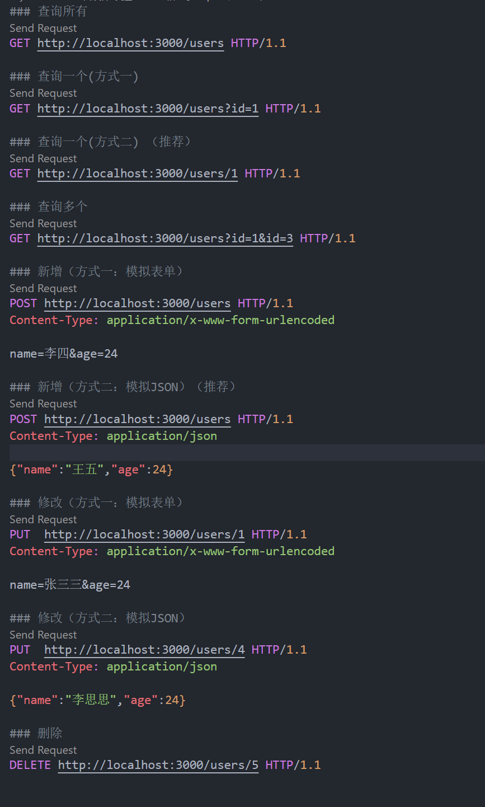

## 解决端口被占用问题

在命令行输入`netstat -ano`可以列出所有应用，找到3000端口对应的pid

再到任务管理器中，关掉对应pid的程序

## 接口编程

### 接口概念

是一个规范，比如电脑的usb接口，规定了这个usb标准。生产电脑和生产外设的厂家就可以分别生产，生产完之后，直接插上就可以使用

### 接口文档

接口调用规则说明书

它里面包含请求数据的url，参数，输出内容的说明

它是我们请求后台数据的依据

我们参照接口文档，就能很方便的知道接口的作用，以及接口是如何调用

### 接口编程

前后端按照约定的规则（接口文档），进行编程，编好之后，再联调测试

前端，主要发送请求（需要明确请求方式，请求的URL，请求参数）

后端，主要做出响应（需要明确响应状态码，状态码描述，以及具体返回的数据）

### 接口编程的好处

可以实现前后端分离，便于协同开发

## restful接口设计

### 概念

一种接口设计风格,主要用于有客户端和服务端交互的软件

### 六要素

以设计登录接口案例为例讲解

#### 前端

- HTTP动词: 请求方式(post请求)
- 资源路径: 请求的url (http://localhost:3000/login)
- 过滤信息: 请求参数(username=张三&password=123)

#### 后台

- 状态码:200(请求OK)
- 错误信息:出错的时候给出提示或者异常信息
- 返回结果:前端想要的数据(登录成功,返回登录用户的相关信息)

### 常见的HTTP动词

以图书管理系统为例

```JS
GET:获取资源(一个或者多个)	获取所有的图书列表,获取单个图书信息
POST:新增资源				新增了一本图书
PUT:修改资源  			    修改图书信息
DELETE:删除资源				删除某一本图书
```

## restful接口体验

### json-server

一个快速成型的Restful接口服务工具,使用它可以快速搭建一个Restful风格的服务器

程序员只需要提供数据，json-server就可以根据你提供的数据将后台搭建起来

### 搭建json-server服务器

1. 安装json-server包

   ```powershell
   npm i json-server@0.17.4 -g
   ```

2. 创建data.json，作为数据源

   ```json
   {
     "users": [
       {
         "id": 1,
         "name": "张三三",
         "age": "24"
       },
       {
         "id": 2,
         "name": "xiaomei",
         "age": 18
       },
       {
         "id": 3,
         "name": "xiaopang",
         "age": 1
       },
       {
         "name": "李思思",
         "age": 24,
         "id": 4
       }
     ]
   }
   ```

   

3. 启动服务

   ```powershell
   json-server -w data.json
   ```

### 前台发送请求

vscode安装REST Client插件

使用restclient模拟前端向后台请求数据（发送Restful风格的请求）

```
	查找所有(GET请求)
		GET http://localhost:3000/users HTTP/1.1
	查询一个(GEF请求)
		GET http://localhost:3000/users/1 HTTP/1.1
	新增(POST请求)
		POST http://localhost:3000/users HTTP/1.1  + 请求空行 + 请求体
	修改(PUT请求)
		PUT http://localhost:3000/users/1 HTTP/1.1  + 请求空行 + 请求体
	删除(DELETE请求)
		DELETE http://localhost:3000/users/1 HTTP/1.1
```

#### 示例



## 异步编程

### 原生AJAX

1. 创建XMLHttpRequest对象

   ```js
   const xhr = new XMLHttpRequest()
   ```

2. 设置请求方式和请求的url

   ```js
   xhr.open('GET', 'http://localhost:3000/users/1')
   ```

3. 监听请求的状态,设置处理函数

   ```js
   xhr.addEventListener('readystatechange', function () {
       // 如果请求完成且响应就绪
       if (this.readyState == 4 && this.status == 200) {
           // 说明本次响应成功.可以拿到数据
           console.log(this.responseText)
           // 转成js对象
           const user = JSON.parse(this.responseText)
       }
   })
   ```

4. 发送请求

   ```js
   xhr.send()
   ```

### Promise函数封装AJAX

```js
function getData(method, url) {
    return new Promise((resolve, reject) => {
        const xhr = new XMLHttpRequest()
        xhr.open(method, url)
        xhr.addEventListener('readystatechange', function () {
            if (this.readyState == 4 && this.status == 200) {
                console.log(this.responseText)
                const data = JSON.parse(this.responseText)
                resolve(data)
            }
        })
        xhr.send()
    })
}
```

### fetch

#### 概念

是web提供的一个可以获取异步资源的api，目前没有被所有浏览器支持。返回一个promise对象

#### 格式

```js
//兑现值是一个response对象
fetch(url).then(res=>{ 
    return res.json()
}).then(data=>{
    console.log(data)
})
```

##### 示例

```js
const res = fetch('http://localhost:3000/users')
// 返回一个兑现的promise对象，兑现值是一个response对象
console.log(res)
res
    .then(res => {
    console.log(res)
    // 需要对response对象使用json()方法序列化出来
    const data = res.json() // 序列化操作只能操作一次
    console.log(data) // 得到的又是一个promise对象，它的兑现值是我们需要的数据
    return data ////回调函数返回的promise对象的状态和结果将成为then返回的promise的状态和结果
})
    .then(data => console.log(data)) //在data中拿到了数据
```

### aixos

#### 概念

Axios 是一个基于 Promise 的 HTTP 库，可以用在浏览器和 node.js 中

#### 引入方式

通过script标签的src属性引入。位置可以在head标签内，醒目

##### 方式一:使用在线引入的方式

```html
<script src="https://cdn.jsdelivr.net/npm/axios/dist/axios.min.js"></script>
```

##### 方式二:使用本地引入的方式

先使用npm下载axios包

```powershell
npm i axios
```

然后在页面中引入

```html
<script src="./node_modules/axios/dist/axios.min.js"></script>
```

#### 简写格式

为方便使用，官方为所有支持的请求方法提供了别名，可以直接使用别名来发起请求

```js
axios.request(config)
axios.get(url[, config])
axios.delete(url[, config])
axios.head(url[, config])
axios.post(url[, data[, config]])
axios.put(url[, data[, config]])
axios.patch(url[, data[, config]])
```

请求返回一个兑现的promise对象，兑现值是一个对象。为了获取兑现值，需要使用promise对象的then()方法

```js
axios.get(url).then(onFulfilled)
axios.post(url).then(onFulfilled)
axios.put(url).then(onFulfilled)
axios.delete(url).then(onFulfilled)
```

但一般只有get请求需要获取兑现值

#### 通用格式

```js
axios({
    methd:'GET',//请求方式,默认是get
    url:'',//请求地址
    params:{},//请求的url参数,只能用在get请求中
    data:{},//请求体数据,只能用在post和put请求中
    timeout:100 //请求的超时时长,单位是毫秒,这个属性一般不写
})
```

#### 示例

```js
axios.get('http://localhost:3000/users').then(res => {
    console.dir(res)
    console.dir(res.data) //我们需要的数据在对象的data属性里
})
```

##### 请求一个用户

###### 方式一：通过查询参数筛选当前路径下的元素

```js
axios.get('http://localhost:3000/users?id=1').then(res => {
    console.dir(res)
    console.dir(res.data) //data是一个数组，里面有一个对象元素
    console.log(res.data[0])
})
```

###### 方式二：通过路径访问到指定元素

```js
axios.get('http://localhost:3000/users/1').then(res => {
    console.dir(res)
    console.dir(res.data) //data是一个我们需要的对象元素
})
```

###### 方式三：通过params属性指定参数

工作原理和方式一一样

```js
// 参数使用params指定
// 跟方式一原理是一样的
axios.get('http://localhost:3000/users', { params: { id: 1 } }).then(res => {
    console.dir(res)
    console.dir(res.data) //data是一个数组，里面有一个对象元素
    console.log(res.data[0])
})
```

##### 请求多个用户

###### 方式一

```js
axios.get('http://localhost:3000/users?id=1&id=3').then(res => {
    console.dir(res)
    console.dir(res.data) //data是一个数组，里面有两个对象元素
    console.log(res.data[0])
    console.log(res.data[1])
})
```

###### 方式二

```js
axios.get('http://localhost:3000/users', { params: { id: [1, 3] } }).then(res => {
    console.dir(res)
    console.dir(res.data) //data是一个数组，里面有两个对象元素
    console.log(res.data[0])
    console.log(res.data[1])
})
```

##### 新增一个用户

###### 简写格式

防止陷入新增死循环，将请求绑定到按钮点击事件

```html
<button type="button">新增</button>
<script>
    document.querySelector('button').addEventListener('click', function () {
    axios.post('http://localhost:3000/users', { name: '王五', age: 24 })
})
</script>
```

###### 通用格式

```html
<button type="button">新增</button>
<script>
    document.querySelector('button').addEventListener('click', function () {
        axios({
            method: 'POST',
            url: 'http://localhost:3000/users',
            data: { name: '王五', age: 24 },
        })
    })
</script>
```

##### 修改一个用户

###### 通用格式

```html
<button type="button">修改</button>
<script>
    document.querySelector('button').addEventListener('click', function () {
        axios({
            method: 'PUT',
            url: 'http://localhost:3000/users/5',
            data: { name: '钻石王老五', age: 24 },
        })
    })
</script>
```

##### 删除一个用户

###### 简写格式

```html
<button type="button">删除</button>
<script>
    document.querySelector('button').addEventListener('click', function () {
        axios.delete('http://localhost:3000/users/5')
    })
</script>
```

###### 通用格式

```html
<button type="button">删除</button>
<script>
    document.querySelector('button').addEventListener('click', function () {
        axios({
            method: 'DELETE',
            url: 'http://localhost:3000/users/5',
        })
    })
</script>
```

###### 其他配置——全局默认值

```html
<button type="button">删除</button>
<script>
    // 定义一个全局默认的基础url
    axios.defaults.baseURL = 'http://localhost:3000'
    document.querySelector('button').addEventListener('click', function () {
        axios({
            method: 'DELETE',
            url: '/users/5',
        })
    })
</script>
```

## 测试接口

之前使用vscode的插件REST Client测试接口，考察了请求响应消息的掌握

现在可以使用Apifox更方便地测试接口
